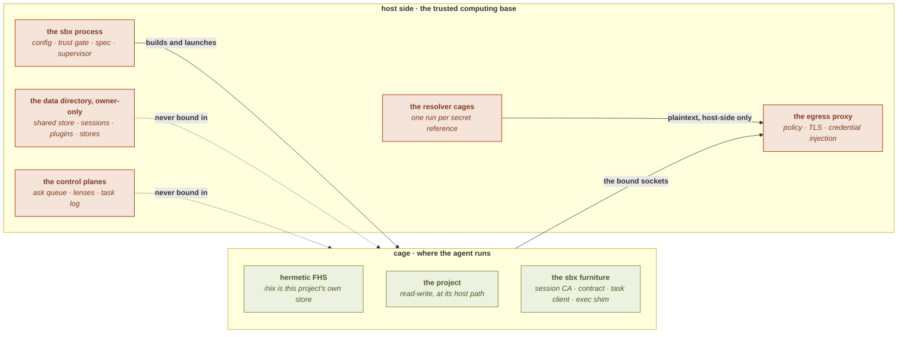
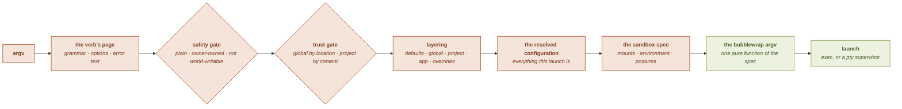
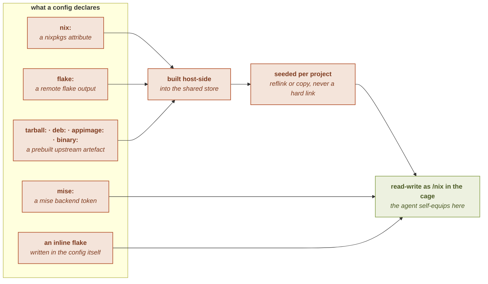
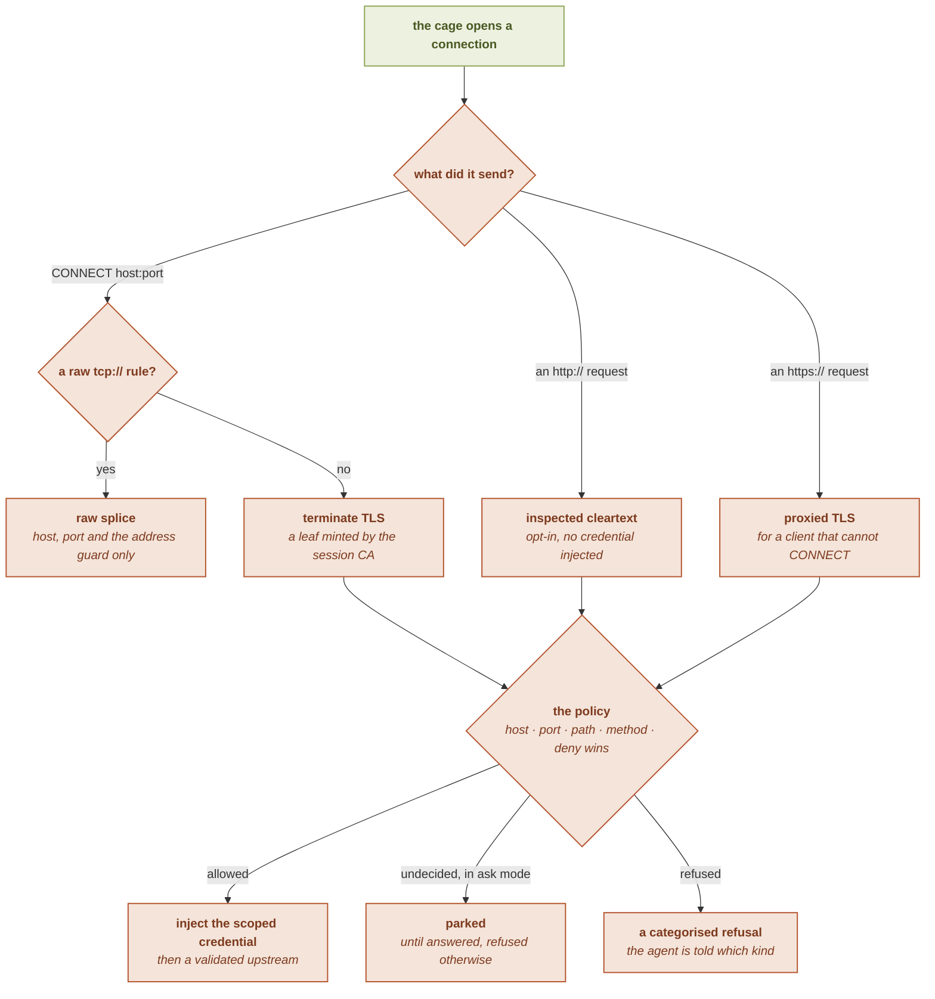
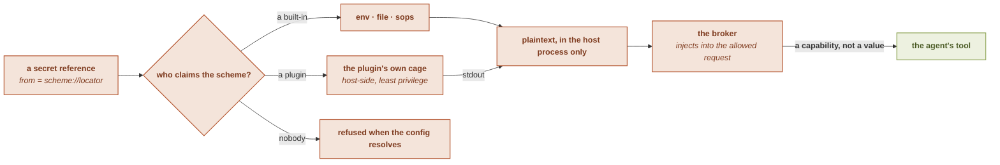
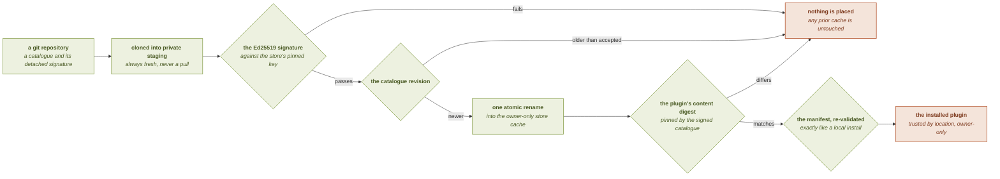
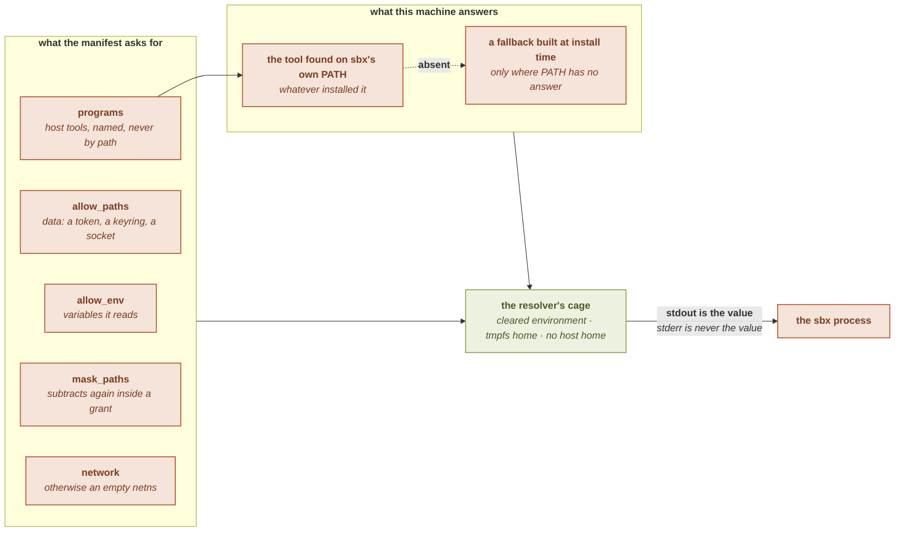

# Architecture

Every other page in this guide owns one subsystem. This page is the map: what the parts
are, which side of the boundary each one runs on, and what is allowed to cross.

See also: [What sbx is](./) · [Security model](security-model) ·
[Enforcement stack](enforcement) · [Directory layout](directory-layout).

## One process, no daemon

`sbx` is a single binary, and nothing of it runs between launches. Everything that
*decides* lives on the **host side**, inside the process you invoked: it reads the
configuration, applies the trust gate, resolves the secrets, builds the description of the
sandbox, launches it, and supervises what it launched.

The cage holds no policy of its own. It receives a filesystem, an environment, and a small
number of sockets, and every one of those was placed there by a decision taken before it
existed. That asymmetry is the architecture in one line: **the cage cannot reach the thing
that judges it.**

The dotted edges carry the same weight as the solid ones. The data directory holds the
session registry, the installed plugins, the verified stores and the sockets that answer
for the cage, and none of it is reachable from inside; a read-write
[`binds`](../configuration/binds) that would expose it is pinned read-only instead.

## From a command to a cage

One pipeline serves every launching verb. The stages are ordered so that nothing
attacker-controlled is acted on before it has been gated.

Four properties of that chain are load-bearing.

**The help table is the grammar.** One table of pages carries every verb's synopsis,
options and prose, and the usage text, the error messages and the shell completion all
render from it, so what the binary accepts and what it documents cannot drift apart.

**The safety gate runs before the parse.** A project's config is attacker-controlled the
moment you `cd` into a cloned repository, so reading one is itself a security operation: a
file that is not a plain, owner-owned, non-world-writable regular file is refused before
its bytes are acted on. The [trust gate](trust) then decides whether the project's
security-relevant fields apply at all, keyed to a hash of the whole file.

**The spec is the only description of exposure.** Everything the cage will see is declared
in one place, and the translation to a bubblewrap argument list adds no exposure of its
own. The mandatory hardening (every namespace, dropped capabilities, a cleared environment,
a fresh session) is emitted unconditionally rather than stored as a toggle, so an
unhardened cage is not a thing that can be described. A security review therefore has a
single surface to read.

**The environment never travels in the argument list.** A process's arguments are
world-readable, so the resolved environment is handed to bubblewrap through a file
descriptor rather than through its argv.

## What the cage is made of

The cage starts from nothing: a path that is not mounted is not merely unreadable, it is
absent. What a launch assembles on that empty base:

| Zone | What it is | Writable |
|---|---|---|
| the hermetic FHS | shell, coreutils, loader, resolved from sbx's own store | no |
| `/nix` | this project's own store, seeded from the shared one | yes |
| the project | bound at its real host path, so paths in output still mean something | yes |
| `$HOME` | the project's runtime home, or an [app's isolated home](../apps/home) | yes |
| a synthetic `/etc` | hosts, passwd, machine-id, locale, time zone, CA bundle | no |
| `/dev` | a minimal device tree, never the host's, plus any [granted device](../configuration/devices) | mixed |
| the sbx furniture | what the postures call for: the session CA, the [egress contract](../reference/environment-variables), the task client, the exec shim | no |

Nothing else of the host is there unless a trusted [`binds`](../configuration/binds) entry
put it there, and the [`[fs]`](../configuration/fs) table can subtract from the project
tree itself. Because the cage runs as **your uid**, read-only is not a confidentiality
control: what must stay secret is absent, not merely unwritable.

## The control planes

A running session is served by several small Unix-socket planes. The rule that places each
one is a single question: is this something the agent is *meant to use*, or something that
*judges or records* the agent?

```mermaid
flowchart TB
    subgraph incage["<b>bound into the cage</b>"]
        direction TB
        E["<b>the egress socket</b><br/><i>the only path to the network</i>"]
        T["<b>the task socket</b><br/><i>invoke a declared operation</i>"]
        S["<b>the ssh-agent socket</b><br/><i>ask for a signature, never hold a key</i>"]
        F["<b>the forward sockets</b><br/><i>a host loopback port, inbound</i>"]
        H["<b>the exec handoff socket</b><br/><i>the shim is its client, not the agent</i>"]
    end

    subgraph hostonly["<b>host side only · never bound in</b>"]
        direction TB
        A["<b>the ask queue</b><br/><i>answer a parked request</i>"]
        L["<b>the lens sockets</b><br/><i>exec · filesystem · egress · ssh-agent</i>"]
        TL["<b>the task control socket</b><br/><i>the invocation log, and stop</i>"]
        REG["<b>the session registry</b><br/><i>liveness-validated records, no daemon</i>"]
    end

    classDef hs fill:#F4E4DA,stroke:#B4552F,stroke-width:1.5px,color:#7E3B1F
    classDef cs fill:#EDF1E0,stroke:#8FA557,stroke-width:1.5px,color:#4A5A24
    class E,T,S,F,H cs
    class A,L,TL,REG hs
```

The split is not stylistic. Under the [agent posture](./), the process inside the
cage is the adversary: a reachable ask queue would let it answer its own requests, and a
reachable lens would let it read or amend the record of what it did. So the sockets on the
right live beside the data directory, which the cage never sees, and answering one is
inherently a host-side act.

One plane is bound in for neither reason, and it is the one that enforces *against* the
agent. Only the kernel can hand out the descriptor that lets a supervisor decide an
`execve`, and only a process inside the cage can obtain it, so a minimal shim installs the
filter, passes the descriptor out over a socket bound in for that purpose, and becomes your
command. The client there is the shim rather than the agent, and what crosses is a
descriptor rather than a request. See [`[proc]`](../configuration/proc).

The registry needs no daemon either. Each launch writes a record, and a reader re-checks
liveness and prunes the dead ones, so a crash is self-healing rather than a leak. Liveness
is a process identifier paired with its start time, because the kernel reuses identifiers
and a bare one would let a stranger masquerade as a live session.

## Provisioning

A project names its tools by backend, and the backend decides *where* the work happens.
Anything built from source or fetched from upstream is done host-side, before the agent
exists; what the agent equips for itself lands in the copy of the store that is its own.

The shared store is written only while sbx itself provisions into it, and is never bound
into a cage. The per-project copy is what the agent gets, so self-equipping is real without
being able to corrupt what other projects consume. Versions move only when
[`sbx upgrade`](../housekeeping/upgrade) rewrites a lock, never because the binary was updated. See
[Provisioning](provisioning) for the store model, and
[`packages`](../configuration/packages) for the backend syntax.

## Egress

Under a filtering posture the cage lives in an **empty network namespace**, so it has no
route to anything: its sole exit is a bound Unix socket to a host process that does have
one. Filtering therefore holds by construction rather than by rule, and the rules only
decide what that one process agrees to carry.

The scheme in a rule selects the **layer**, not just the port: an inspected rule buys path,
method and anti-fronting checks because the proxy sees the plaintext, while a raw rule
carries a protocol that cannot be inspected and keeps only the controls a byte stream can
bear. Both cleartext and raw are strictly opt-in, so a permissive posture never silently
opens either. One classifier serves both the config layer and the live proxy, so a rule is
rejected when it is written rather than misread when it matters.

The details live in [Network modes](../networking/modes), [Rule grammar](../networking/rules)
and [Architecture: Model B](../networking/architecture).

## Secrets: a source layer and a sink layer

A credential has two independent halves, and keeping them apart is what makes the
invariant statable: **no plaintext secret ever exists inside the cage.**

The **source** answers where a value comes from, and is pluggable. The **sink** puts it on
the wire, and never is: the sink terminates TLS and decides a request, so a bug there is a
boundary breach, and it stays first-party by design. Between them the plaintext lives only
in the host process's memory, and reaches the network scoped to the one host it was
declared for.

Two tripwires stand around that arrangement rather than holding it up: an outbound one
refuses a request whose head carries a configured value verbatim, and an inbound one masks
a value an injection target reflects back. Both are backstops with a stated evasion, and
neither is the boundary. See [Secrets](../secrets/),
[Injection](../secrets/injection) and [Redaction](../secrets/redaction).

## Resolver plugins

A plugin is a directory with a manifest and an executable that turns one `scheme://`
reference into a plaintext. Because it sees plaintext, it is in the trusted computing base,
and the architecture answers that fact twice: once for **how it arrives**, and once for
**what it is allowed to touch while it runs**.

### How a plugin arrives

A plugin store is a git repository, and git moves bytes while checking their integrity, not
their origin. So the transport is not a trust boundary and authenticity comes from a
signature instead. Each link fails closed.

Three consequences are worth stating on their own.

**The registry is trusted by location, and that rests on the data directory.** An installed
plugin lives under a tree kept owner-only, which a project (which writes only the project
directory) cannot plant anything in. A project's config may therefore *reference* a scheme
but never *supply* one, and whether it may even reference it is the ordinary secret trust
gate: an untrusted project's whole secret section is dropped before any scheme is looked
up.

**Where a plugin came from is recorded outside the plugin.** The catalogue pins a directory
by hashing its contents, so a provenance file placed inside would put every installed
plugin permanently out of agreement with the hash that was signed. The record lives beside
the tree instead, and reading it is lenient: an unknown origin is the honest answer for a
plugin installed before origins were recorded, and it must never break a listing.

**Loading a plugin can never fail a launch.** A malformed manifest, an unsupported type, a
reserved scheme, or two plugins claiming one scheme drops the offending plugin with a
warning. A contested scheme resolves to *nothing* and every claimant is disabled until one
remains, and installing is refused on both sides of that state, so the conflict is reported
rather than silently resolved in someone's favour.

### What a plugin may touch while it runs

The plugin runs in **its own bubblewrap cage on the host side**, never in the agent's. It
inherits the same mandatory hardening every cage gets, and the manifest's grant is the only
thing added on top.

A manifest names the **tool**, not a location, because where a binary lives is a property of
the machine and not of the plugin: enumerating install directories was at once too wide (a
nix profile's binaries are links into a store, so reaching one meant binding all of it) and
too narrow (no list covers every package manager). `PATH` always wins, so a machine that
has the tool uses the tool it has, and nothing in a manifest can redirect a plugin to a
different binary.

A manifest also deliberately **cannot answer for itself**. What a plugin asks for and what
this machine supplies are separate statements: the values for its variables, and the
nixpkgs attribute to build when a tool is simply missing, are declared in your own config,
gated like any other security field. That is what keeps installing a third-party plugin
from becoming permission to provision software on your host. The build happens when you
install, which is where a build is expected; a launch only reads the result.

Three outcomes are distinguished, because collapsing them would be a security bug: a clean
exit with output is a resolved secret, a clean exit with none is an *absent* value that
falls through to the next source in a chain, and a failure is hard and fail-closed, so a
broken resolver can never silently downgrade to a weaker source.

The full manifest reference is in [Plugins](../plugins/), and the store
workflow in [Signed plugin stores](../plugins/stores).

## Declared operations

A [declared operation](../tasks/) is the answer to a job that needs a credential the
agent must not hold. The command is fixed by your config, the caller can influence exactly two things (the
declared parameters, each re-checked against the bound it was validated under, and the
names of the variables it is allowed to pass), and it runs in an **ephemeral sibling cage**
rather than the agent's:
the agent's store is writable and its processes are readable to itself, so a task running
there could have its binary swapped or its environment read. The sibling cage takes the
same structural skeleton with three differences: an immutable store, a read-only project,
and a fresh home, with every non-structural exposure dropped.

The client the agent gets is a small generated script with a handful of verbs, not sbx
itself, so the vocabulary reachable from inside is exactly the vocabulary intended.

## The observation lenses

Four lenses answer four questions about a live session: what it ran, what it wrote, where
it went, and what it asked your keys to sign. Each keeps a bounded record in the
supervisor's or the proxy's memory rather than on disk, and each is read over a socket the
cage never sees. A lens is not a fence: only the exec lens has an enforcing sibling, and
only egress has a policy behind it. See [Observability](observability).

A lens answers a question you thought to ask. The [`[notify]`](../configuration/notify)
policy is the other direction: it tells you, unprompted, that a restriction just bit. That
is why it is a security field rather than a cosmetic one. A refusal notice is the one
signal that the boundary is working, so a project config able to silence it could hide
exactly what the boundary exists to surface, and it would do so from the side the boundary
contains.

## Desktop access

The graphical postures are holes with stated costs, all of them trusted-only. A display
posture provisions the fonts and certificate trust a browser engine needs and, at its
widest, binds the compositor socket. GPU access grants a render node and the device tree a
driver reads. Audio binds a bus that is not per-client isolated, which is why it is its own
decision. A private in-cage desktop portal is different in kind: it stands up its own bus
*inside* the cage, so a file chooser sees only the cage. See
[`gui`](../configuration/gui), [`gpu`](../configuration/gpu),
[`audio`](../configuration/audio) and [`dbus`](../configuration/dbus).

## Where each decision is made

| Decision | Made by | Enforced at |
|---|---|---|
| may this config's security fields apply | the trust gate, on file contents | configuration resolution |
| what the cage can see of the host | the mount list in the spec | the sandbox argument list |
| what syscalls are reachable | the mandatory denylist, relaxable only when trusted | the kernel, every launch |
| what the agent may execute | the [`[proc]`](../configuration/proc) posture | a parked syscall, host-side verdict |
| how much it may consume | the [`[limits]`](../configuration/limits) table, over built-in defaults | a cgroup scope, best-effort |
| where the agent may connect | the egress policy | the host proxy for the cage's own traffic; the same policy admits a [`tcp://` broker](../configuration/broker#the-honest-limits), which it does not inspect |
| which credential goes where | a host-scoped secret entry | the proxy, on the wire |
| where a secret's value comes from | a scheme, built-in or plugin | a host-side resolver cage |
| what a plugin may touch | its signed manifest, plus your own answer | the resolver's cage |
| what a task may run | the declared command | an ephemeral sibling cage |
| whether you hear about a refusal | the [`[notify]`](../configuration/notify) policy | the host desktop, or stderr |

Read next: the [security model](security-model) for the threat framing, or the
[enforcement stack](enforcement) for the layers that hold it.
