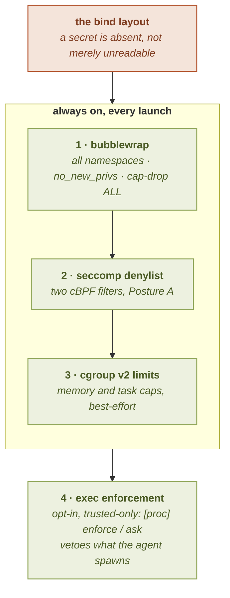

# Enforcement stack

The **primary** security control in `sbx` is the bind layout. Because the cage
runs as *your* uid (same-uid), confidentiality comes from a secret being **absent**
from the cage, not from any in-kernel permission check: see
[Security model](security-model). Everything on this page is **defense in depth
layered on top of that**: even a cage whose bind set is correct also runs behind an
always-on stack of kernel and userspace controls, so a mistake or an exploit in one
layer is not the whole boundary.

See also: [Security model](security-model) · [`limits`](../configuration/limits) · [Networking](../networking/).

Every launch: `sbx run`, `sbx app`, and even the `sbx doctor`
smoke: goes through the same three always-on layers:

1. **bubblewrap**: namespaces, `no_new_privs`, all capabilities dropped.
2. **seccomp**: a two-filter syscall denylist (Posture A).
3. **cgroup v2**: resource limits to bound denial-of-service, best-effort.

The order matters in one direction only: the layers below do not *replace* the bind
layout, they bound what a mistake in it can become.

Plus one **opt-in, trusted-only** layer: **exec enforcement** via
[`[proc] mode = "enforce"`/`"ask"`](../configuration/proc): a seccomp
user-notification gate that blocks a denied `execve` before it runs. It is a
**guardrail** (it vetoes what an agent *spawns*, not what it does in-process),
layered on top of the three always-on controls, not a replacement for them.

## 1. bubblewrap hardening

The base cage is a non-setuid [bubblewrap](https://github.com/containers/bubblewrap)
process. On a modern kernel bwrap runs through unprivileged user namespaces, so
there is no setuid binary to attack. The hardening flags below are emitted
**unconditionally**, an unhardened cage is not representable, it is not a toggle:

- **All namespaces**: user, pid, mount, ipc, uts, cgroup. The user namespace is
  the enabler for the rest; `--unshare-pid` is required for same-uid to be safe.
- **`no_new_privs`** (`PR_SET_NO_NEW_PRIVS`): no setuid re-privileging, and the
  precondition for loading an unprivileged seccomp filter.
- **Drop all capabilities** (`--cap-drop ALL`): no ambient capabilities inside
  the namespace.
- **`--die-with-parent`**: the cage cannot outlive its supervisor.
- **`--clearenv`**: the environment is rebuilt from empty, not inherited.
- **`--new-session`**: a fresh session, which blocks terminal-input injection
  (`TIOCSTI`) at the source.

> **The `--new-session` nuance.** `--new-session` is the default and is used by a
> non-interactive `sbx run`. An interactive `sbx run` (a shell, or an interactive
> command) omits it because it needs a controlling terminal for job control: the pty
> supervisor establishes the session itself and keeps the pty master, so the launching
> terminal stays unreachable either way.

The cage's `/dev` is also **minimal and hostless**: `null`/`zero`/`urandom`/`tty` and the
standard descriptor symlinks, never a real host device. A tool that genuinely needs the GPU,
a VPN tunnel, KVM, or FUSE can bind a specific device node with a trusted
[`[devices]`](../configuration/devices) grant; like the seccomp relaxation below, this is
trusted-only surface reduction undone, not a change to the namespace/capability boundary.

The absence of a capability-bearing user namespace is a **hard failure**, never a
silent fallback to a weaker engine. See [`sbx doctor`](../getting-started/doctor).

## 2. The seccomp denylist (Posture A)

bwrap ships no default seccomp filter; `sbx` compiles its own with
[`seccompiler`](https://crates.io/crates/seccompiler) (pure Rust, so the static
binary stays self-contained) and hands it to bwrap as **two cBPF filters** via
`--add-seccomp-fd`. The policy is **default-allow with a denylist**: pragmatic for
the open-ended toolchains an agent runs, at the cost of being weaker than an
allowlist (an unknown or brand-new syscall passes). This is the accepted residual
for the agent (Mode B) threat model.

Two filters are needed because one `seccompiler` program carries one match action:

### The EPERM set

Syscalls that return `EPERM`: the historically abused set plus the mount and
namespace family:

- **ptrace family**, `ptrace`, `process_vm_readv`, `process_vm_writev` (no memory
  inspection or patching of sibling processes).
- **mount / namespace family**: `unshare`, `setns`, `mount`, `umount2`,
  `pivot_root`, `chroot`.
- **kernel modules**: `init_module`, `finit_module`, `delete_module`.
- **kexec / reboot**: `kexec_load`, `kexec_file_load`, `reboot`.
- **introspection / perf**: `bpf`, `perf_event_open`.
- **`io_uring`**: `io_uring_setup`, `io_uring_enter`, `io_uring_register`
  (io_uring can create sockets and do I/O without the corresponding syscalls, so it
  would bypass a syscall-level filter; block it outright).
- **kernel keyring**: `keyctl`, `add_key`, `request_key`.
- **`userfaultfd`**.
- **misc privileged**: `swapon`, `swapoff`, `acct`, `syslog`, `sethostname`,
  `setdomainname`, `ioperm`, `iopl`, `personality`.
- **argument-filtered `clone`**: denied only when arg0 carries `CLONE_NEWUSER` or
  `CLONE_NEWNS` (the independent user-namespace escape path).
- **argument-filtered `ioctl`**: `ioctl(TIOCSTI)` and `ioctl(TIOCLINUX)` (tty
  injection), while a benign `ioctl` such as `TIOCGWINSZ` is untouched: the
  arg-filter is selective, not a blanket `ioctl` block.

### The ENOSYS set

A second filter returns `ENOSYS` (rather than `EPERM`) for:

- **`clone3`**, mandatory. On `ENOSYS`, glibc falls back to the older `clone`; on
  `EPERM` it would not, and **all process creation would break**. Returning
  `ENOSYS` both closes the arg-filter bypass (`clone3` could set the namespace flags
  the `clone` filter watches) and preserves `fork`.
- **the new mount API**: `open_tree`, `move_mount`, `fsopen`, `fsconfig`,
  `fsmount`, `fspick`, `mount_setattr`.

### Why the mount / namespace block matters

Blocking the mount and namespace family makes the
`user-namespace → mount → overlayfs / pivot_root` code paths **unreachable** in the
cage. That is a real reduction of the most common Linux local-privilege-escalation
class. (Dropping all capabilities already neuters a *nested* user namespace on its
own, the single-uid map cannot map root, so this block is attack-surface
reduction, not the sole escape stop.)

### Reconciled with in-cage nix

An agent self-equips by running `nix build` / `mise install` **inside** the cage,
and nix's own build sandbox wants exactly the `unshare` / `clone(NEWNS)` / `mount` /
`pivot_root` syscalls this filter refuses. Because seccomp is process-wide and
inherited, one filter cannot allow those for nix yet deny them for the agent. So
`sbx` forces nix's `sandbox = false` and `filter-syscalls = false` (via a
`NIX_CONFIG` that a project cannot smuggle, since those keys are on the
untrusted-only environment denylist). The cage, not nix's inner build sandbox, is
the boundary, and the agent already runs arbitrary code in it, so this is within the
Mode-B threat model.

### Relaxing the denylist (trusted-only)

The denylist is mandatory by default, but a **trusted** config can re-permit a
specific denied syscall with [`[seccomp] allow`](../configuration/seccomp): so a
debugger (`ptrace`), profiler (`perf_event_open`), or nested-container tool can run in
the cage. The grammar is uniform (a bare name lifts the whole syscall; `clone`/`ioctl`
also accept a `:selector` that lifts one sub-rule); loosening is trusted-only (an
untrusted project's relaxation is dropped), and each token that reopens a real escape
surface is surfaced with a caution. This reduces the surface reduction above: never the
namespace/capability boundary itself, and does **not** re-enable nix's inner sandbox.

### Carve-outs kept allowed

`socket(AF_UNIX)`, `socketpair`, and `recvfrom` are **deliberately permitted**. The
Model-B egress forwarder (`socat`, bridging the empty network namespace to the
host-side proxy over a Unix socket) needs `AF_UNIX`, and common toolchains use
`socketpair`-based subprocess plumbing. Both seccomp filters were verified to leave
these three reachable.

### Scope and fail-closed

The filters target `x86_64` and `aarch64`. On a host without `CONFIG_SECCOMP` the
filter cannot load, and the launch **fails closed**: seccomp is a mandatory control
here, not best-effort. It is loaded on every launch path, including the `sbx doctor`
smoke, so `doctor` proves the real launch path *with* the filter active.

## 3. The environment is loaded off the argument list

A process's **environment** is private (`/proc/<pid>/environ` is mode `400`, readable
only by the process's own uid), but its **arguments** are not
(`/proc/<pid>/cmdline` is mode `444`, readable by every uid on the machine). Putting
a credential in the bwrap argument list would publish it to every user for as long
as the cage runs.

So `sbx` does **not** pass the cage's environment as bwrap arguments. The flow is:

1. **The pure stage** ([`src/sandbox/argv.rs`]) builds a "skeleton" argument vector
   whose only environment-related entry is a single placeholder
   (`@sbx-env-args`) where bwrap's `--args N` flag will read the environment from.
2. **The impure stage** opens a [`memfd_create`](https://man7.org/linux/man-pages/man2/memfd_create.2.html)-backed
   in-memory file, writes the cage's environment to it in bwrap's `--args` encoding
   (NUL-separated triples for `--setenv KEY VALUE`), and replaces the placeholder
   with that file's descriptor number.
3. bwrap reads the descriptor exactly once, at exec, and inherits it: a precise
   mechanism, `O_CLOEXEC` is deliberately **not** set so the descriptor survives
   bwrap's own exec.

The result: a credential in `[secret]`, in `[env]`, or resolved by a plugin is never
visible to any other uid, while the cage still gets it on first exec. Failing closed:
a name or a value containing a NUL byte is **refused** at the descriptor-write step
(NUL is the separator on the wire, so a NUL-bearing value would break out of its own
argument and turn what follows it into further bwrap arguments: `--bind /home /home`
written by whoever supplied the value). Removing the byte would change the secret;
not launching is the correct outcome.

This is the only documented mode: `--clearenv` is always emitted, the cage's
environment is rebuilt from nothing on the descriptor, and the credentials, when
present, are written first so a credential that took the name of the cage's own
plumbing (`PATH`, `HOME`) loses to the plumbing. The skeleton bwrap argv is **pure**
(same `SandboxSpec` in, same argv out, no I/O), and the impure step is exactly the
memfd write. A test rejects any name or value carrying a NUL, and asserts that
credentials are spliced in declaration order ahead of plain environment entries.

## 4. cgroup v2 resource limits (anti-DoS)

Nothing in the namespace, seccomp, or egress layers bounds *resource consumption*, an in-cage agent could fork-bomb, exhaust memory, or peg the CPU. `sbx` wraps the
cage in a **transient systemd user scope**
(`systemd-run --user --scope`) carrying cgroup v2 limits. `systemd-run` exec-chains
into the cage (it registers the scope, moves itself in, then execs), so it behaves
like a plain argv prefix: the process tree and pty job control are unchanged.

The default profile:

| Limit | Property | Effect |
|---|---|---|
| Memory throttle | `MemoryHigh=80%` | reclaim / throttle threshold, a heavy build slows under pressure and survives, rather than being killed |
| Memory ceiling | `MemoryMax=90%` | a hard **per-cage** OOM ceiling |
| Task cap | `TasksMax=16384` | the host-wide anti-DoS win, any finite bound defeats a fork-bomb, while the cap sits far above any real `make -j` |

There is **no `CPUQuota`** by design: CPU saturation is self-resolving through the
scheduler, and a hard quota would mostly just slow legitimate builds.

**The memory ceiling is per-cage, not host-global.** `MemoryMax=90%` bounds one
cage relative to total RAM, so *N* concurrent cages can sum past it. The clean
host-wide guarantee is the **task cap**; the memory ceiling is per-cage protection.

### Best-effort, never the boundary

Resource limits are hardening, not the security boundary: so unlike the
namespace / seccomp / egress layers, they **never hard-fail**. Where there is no
cgroup v2, no reachable systemd user session, no `systemd-run`, or an
undelegated controller, the cage launches **without** limits rather than regressing
where it previously worked. `sbx doctor` reports whether it could create a limited
scope on this host.

### Overriding the limits

The default profile is overridable from a trusted `[limits]` table in the global or
a project config (and per app), tuned per field. Loosening your own anti-DoS cap
only self-harms, but it is still gated trusted/global-only. See
[`limits`](../configuration/limits).

## 5. Landlock is not (yet) a layer

Landlock (a filesystem access LSM) is a **deferred** defense-in-depth option, **not
a shipped layer**. The hermetic FHS already does the confidentiality job Landlock
would: a secret is *absent* from the cage rather than merely read-only, so a
Landlock ruleset would mostly re-police paths that are not mounted at all. It may be
added later as an extra layer, but the shipped enforcement stack is the three layers
above.

A feasibility spike also confirmed the feature that would have justified it: a
read-only subdirectory (`.git/`, lockfiles) *inside* the read-write project tree: is
**not expressible**: Landlock resolves an access by the *union* of every matching
ancestor rule, so a child rule can only add access, never carve it out. Landlock can
whitelist which trees are writable and restrict per-operation rights (deny delete /
symlink / rename), but it cannot protect a subtree of a directory the agent is meant
to write.

## GUI exposure is Wayland-only

When a cage opens the optional GUI hole, exposure is **Wayland, never X11**. A
Chromium- or Electron-class app runs under the seccomp cage with its own internal
sandbox disabled (`--no-sandbox`): the bubblewrap + seccomp + empty-netns cage *is*
the boundary, replacing Chromium's redundant sandbox rather than removing a
protection. Under a compositor such as Mutter, an ordinary Wayland client is not
advertised the dangerous protocols (screen copy, virtual-keyboard input injection,
clipboard snooping, foreign-toplevel control), which is the basis for the
"Wayland, never X11" rule. (This isolation is compositor-dependent; see the design
spike for the residuals.)

## See also

- [Security model](security-model): the bind layout, the primary control
- [The trust gate](trust): what an untrusted config may not touch
- [`limits` configuration](../configuration/limits): overriding the cgroup profile
- [Networking](../networking/): the egress allowlist and host-side proxy
- [Provisioning](provisioning): the store and in-cage self-equip these layers wrap
