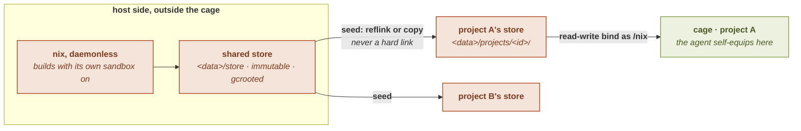

# Provisioning

`sbx` runs tools inside a hermetic cage that has **no host `/usr`** and **no host
`/nix`**. Everything the cage needs (the base userland, the tools a project
declares, and the tools an agent installs for itself) is provisioned by
**daemonless [nix](https://nixos.org/)** into a store `sbx` owns, and bound into the
cage. This page explains that store model and how it stays reproducible.

See also: [Directory layout](../concepts/directory-layout) · [`packages`](../configuration/packages) · [Upgrading](../concepts/upgrade).

## nix as a rolling OS on a channel

Think of the base userland as a **rolling distribution pinned as data**. `sbx`
tracks the `nixos-unstable` channel by default, but the exact revision it uses is
**data-dir state**, recorded in `nixpkgs.lock`, not baked into the `sbx` binary.

The consequence is the property the design calls **"seeded, not baked"**:

> Tool versions move **only** on an explicit `sbx upgrade`. Updating the `sbx`
> binary never changes what versions your projects get.

`sbx upgrade [all|nix|mise|flake]` re-resolves the relevant channel and rewrites its
lock; a launch reads the lock that `upgrade` wrote. See
[Upgrading](../concepts/upgrade) and the [`sbx upgrade` reference](../cli/upgrade).

## The shared store

`sbx` drives nix **daemonlessly**: no host `/nix`, no `nix-daemon`, no multi-user
setup. It provisions the base userland (glibc, gcc, bash, coreutils, and more) into
its own user-owned store at `<data>/store/nix/store`, keeps each output alive with a
gcroot, and binds that store **read-only** into a cage as `/nix`.

Because provisioning runs *outside* the cage (where capabilities are available),
from-source builds run with nix's own build sandbox on; only *inside* the cage is
nix's sandbox forced off (see [Enforcement](enforcement)). A signed,
cache-substituted path is safe to share across projects; the only unsigned paths are
**trusted** local builds you have vouched for, which is why declared
[`packages`](../configuration/packages) are a trust-gated security field.

## The per-project writable store

A read-only shared store cannot host an agent that installs its own tools. So each
project also gets its **own real nix store** under `<data>/projects/<id>/`, and the
cage's `/nix` is a **read-write bind of that per-project store**: the Mode-B
inversion. This is **default-on and never a configurable field**: an untrusted
project cannot keep the shared store mounted or widen its access.

The per-project store is **seeded from the shared store** by reflink-or-copy
(`FICLONE`): copy-on-write where the filesystem supports it (near-free), a full copy
on ext4. Each seeded path is a **physically independent inode**. A hard link was
deliberately rejected, a same-uid write through a hard link would poison the shared
base for every other project: so the seed gives each project a private copy that an
in-cage write can only affect locally.

**Disk cost, in practice.** On a copy-on-write filesystem (btrfs, or xfs with
reflinks) the seed shares blocks with the shared store, so a project's store costs
almost nothing on disk until the cage writes into it: many projects seeded from the
same base together take roughly one copy of it. On **ext4** (no reflinks) each
project's store is a full, byte-for-byte copy of its closure, so *N* projects that
share a base each carry their own copy of it. Reclaim a project's store with
[`sbx gc`](../cli/gc); if per-project duplication matters on your host, putting
`<data>` on a CoW filesystem makes every new per-project seed near-free.



The net effect:

> An agent that self-equips writes **only** into its project's own store. The shared
> store stays immutable, and one project's installs never touch another's.

The per-project directory also holds that project's resolution locks, `nixpkgs.lock` (a project channel pin), `tools.lock` (resolved `nix:` mise tools),
and `flake-packages.lock` (pinned `flake:` packages). See
[Directory layout](../concepts/directory-layout).

## nix and mise in the cage: the agent self-equips

The base userland carries **nix and [mise](https://mise.jdx.dev/) themselves**, so
an agent can equip a project's toolchain from inside the cage, building into the
project's own writable store rather than mutating the host:

```sh
sbx mise install nix:jq                 # build jq into the project's store
sbx mise use -g aqua:BurntSushi/ripgrep # install and activate a tool (on PATH next launch)
```

A tool installed with `mise use` is auto-on-PATH in later launches; a bare
`sbx mise install` installs it but leaves it reachable only through `mise exec`. See
[`tools` configuration](../configuration/tools) and the
[`sbx mise` reference](../cli/mise).

## Hermetic TLS

The cage has no host `/etc/ssl`, so `sbx` provisions its **own** CA certificate
bundle (`cacert`) into the base userland and binds it read-only at **both**
conventional certificate paths: `ca-bundle.crt` (nix's libcurl default) and
`ca-certificates.crt` (the OpenSSL / reqwest spelling). Both are needed because the
two TLS clients in the cage disagree on where the bundle lives. In-cage TLS
therefore never depends on the host having a CA bundle.

## A curated base toolset

The base userland ships a small everyday CLI set: `curl`, `git`, `less`, `grep`,
`rg`, `sed`, `awk`, `find`, `fd`, `jq`, `yq`, `which`: provisioned into `sbx`'s store
and **sharing the base glibc**. An agent gets the ordinary tools without declaring
them, and the in-cage mise plugin has `find` available for its own flake and
extension lookups.

The fast searchers sit **beside** their POSIX elders, they do not replace them.
`grep`, `sed` and `find` stay because third-party code the cage runs assumes them:
a vendor install script piped into a shell, a `configure`, an npm postinstall.
`rg` and `fd` are there because an agent harness looks them up on `PATH` before
falling back to downloading its own copy. `yq` is the YAML and TOML counterpart of
`jq`, and it is the Go implementation, so the base carries no language runtime for
it.

## The nix-ld shim for cross-glibc tools

A tool pinned to a *different* nixpkgs channel than the base is built against a
different glibc. To keep it running, the base userland provides a **nix-ld shim** at
the standard loader path: a foreign binary that hard-codes `/lib64/ld-linux…`
resolves the shim, which re-execs the real base loader named in `NIX_LD`, with the
base libraries offered via `NIX_LD_LIBRARY_PATH` (never a global `LD_LIBRARY_PATH`).
This is what lets a cross-channel [`nixpkgs`](../configuration/nixpkgs) pin work
without an ABI skew.

## Engine independence (release option)

A release build can be made **self-contained**, embedding its own static engines so
it does not depend on host-installed ones. Behind the `bundled-nix` and
`bundled-bwrap` features, `sbx` embeds a static `nix` (2.34.x) and `bwrap` (0.11.x),
materializes them under `<data>/engine/`, and drives its own store with no host nix.
The default build is unchanged and uses the host engines.

The two engines differ in how complete the independence is:

- **nix, total.** When the bundled engine is present, `sbx` uses it in preference
  to a host nix.
- **bwrap: partial.** On a host where
  `kernel.apparmor_restrict_unprivileged_userns` is set, only a binary carrying an
  AppArmor profile that allows `userns` may create an unprivileged user namespace,
  and that profile is attached by path to the host's `/usr/bin/bwrap`. So on a
  restricted host `sbx` keeps the host `/usr/bin/bwrap` (the only bwrap that can
  create the namespace); on an unrestricted host the bundled engine leads. This
  choice is non-regressive by construction.

`sbx doctor` reports which engine it would use and why. See
[`sbx doctor`](../getting-started/doctor).

## See also

- [Directory layout](../concepts/directory-layout): where the stores and locks live
- [`packages` configuration](../configuration/packages): declaring `nix:` / `mise:` / `flake:` tools
- [`nixpkgs` configuration](../configuration/nixpkgs): pinning the channel
- [`tools` configuration](../configuration/tools): mise `[tools]` and self-equip
- [Upgrading](../concepts/upgrade): how versions actually move
- [`sbx mise` reference](../cli/mise) · [`sbx upgrade` reference](../cli/upgrade)
- [Enforcement stack](enforcement): the always-on layers the cage runs behind
