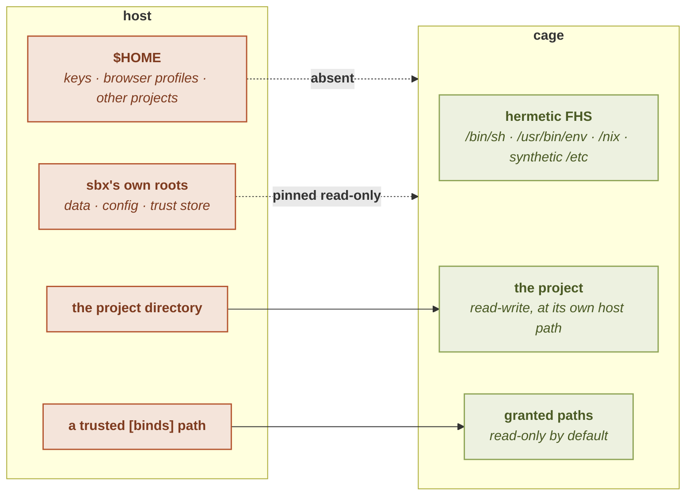

# Security model

`sbx`'s security rests on one central idea: the cage runs **as your uid**
(same-uid), so **the bind layout is the security control**. This page explains what
that means and what it protects.

See also: [The trust gate](trust) · [Enforcement stack](enforcement) · [`binds`](../configuration/binds).

## Same-uid: confidentiality by absence

The sandbox does **not** run as a different user. It runs as *you*. That has a sharp
consequence:

> A read-only bind protects **integrity**, not **confidentiality**. A secret is
> protected by being **absent** from the cage, not by being mounted read-only.

If a file is bound into the cage, even read-only, the process inside can read it,
because it runs as the uid that owns the file. So the way `sbx` keeps your `~/.ssh`,
your browser profile, and your cloud credentials safe from an untrusted agent is
simply that **they are not mounted at all**. The host filesystem is absent by
default; only what a *trusted* config explicitly binds appears.

This is why `sbx` is not a container manager: there is no separate identity to lean
on. The mount set *is* the boundary.

The same reasoning runs inward. The project tree is mounted, so everything in it is
readable, including the `.env` or the private key that lives beside the code. Moving those
files out is the answer that matches the model exactly (absent beats unreadable); when they
have to stay, [`[fs] deny`](../configuration/fs) mounts a decoy over the path so the cage
reads nothing through it. That is a **reduction of exposure**, not the same guarantee as
absence, and its page names the three things it does not cover.

## The hard requirement

There is no security boundary without **capability-bearing unprivileged user
namespaces**. `sbx` treats their absence as a hard failure, never a silent fallback
to emulation (which would isolate nothing while looking sandboxed). See
[`sbx doctor`](../getting-started/doctor).

## The synthetic identity

Inside the cage the process sees a synthetic identity, `uid=1000(sandbox)`, with a
synthetic `/etc/passwd` and `/etc/group` generated **outside** every writable mount,
so the identity's integrity holds even when the agent can write elsewhere. The host
home and the rest of the host filesystem are not present.

The cage also carries a synthetic `/etc/machine-id` (and its `/var/lib/dbus/machine-id`
alias), **deterministic per app-home and unique per home**, never the host's real one.
It costs nothing for a CLI, but a desktop app that fingerprints the machine (an Electron
editor deriving a device id from the machine-id or MAC) would otherwise find neither in a
hermetic cage and fall back to hashing an empty string: the *same* id in every cage,
which some apps' server-side anti-abuse reads as one machine running many accounts. A
distinct per-home id gives each app its own persistent machine identity while leaking no
host identifier.

## The bind zones

The cage's filesystem is assembled from a small, explicit set of binds, layered so a
project's own binds cannot displace `sbx`'s structural mounts:

- **The hermetic FHS**: a minimal `/bin/sh`, `/usr/bin/env`, `/nix` (the store),
  and the synthetic `/etc`. No host `/usr`, no ambient system libraries.
- **The project**, the current working directory, bound so the tool can work on the
  code.
- **Explicitly granted paths**: whatever a *trusted* [`binds`](../configuration/binds)
  declares, read-only by default.

The dotted edges are the ones that carry the model: what is **absent** cannot be read
whatever the agent does, and what is **pinned** stays read-only even inside a broad
read-write bind.

A config bind is emitted *before* the structural mounts, so a colliding entry is
shadowed rather than overriding `/nix` or the synthetic identity. (One known nuance:
a config bind that *nests* with a structural mount, a descendant of `/tmp`, say, is
handled fail-closed and warned about; see [`binds`](../configuration/binds).)

## The control plane is pinned

`sbx`'s own state, its data, trust, and config directories, all under your `$HOME`: is protected even inside a broad read-write bind:

- A read-write bind aimed **at or inside** one of `sbx`'s directories is forced
  read-only, with a warning.
- A broad read-write bind that merely **contains** them (e.g. `mode = "rw"` on your
  whole home) stays read-write, but each of `sbx`'s roots is **pinned read-only in
  place**, so the rest of the tree is writable while the agent still cannot alter
  what `sbx` runs or trusts.

This closes an escalation where a writable parent directory would let the agent
substitute a forged control-plane directory. See [`binds`](../configuration/binds)
for the details and [The trust gate](trust) for why it matters.

## What the trust gate protects

An untrusted project's `.sbx.toml` **cannot** touch security-relevant fields: binds,
network, secrets, packages, GUI, limits, app definitions. Only the free `env` field
applies from an untrusted project (minus a reserved-key denylist). Trust is bound to
the file's content hash on the direnv model, so any edit re-arms the gate. See
[The trust gate](trust).

### An unfree package is a licensing question, not a trust one

`sbx` builds a `nix:` package whose licence is unfree, and does so for every entry in
`[packages]` rather than only for ones known to be proprietary. That is not a hole in
the gate above, and it is worth being explicit about why: the allowance changes whether
nixpkgs agrees to *evaluate* an attribute, never who is allowed to *name* one.

Naming one stays trusted-only, so an untrusted project cannot cause a build of any kind,
free or unfree. The allowance is confined to a single pinned import, evaluated purely, so
it unpins nothing and widens no path. What it does cost you is a licence accepted without
being asked: see [unfree packages build without
asking](../configuration/packages#unfree-packages-build-without-asking).

## The cage's environment is not readable by other users

A process's argument list is world-readable: `/proc/<pid>/cmdline` is mode `444`, so
**any** user on the machine can read every argument of every running process. Its
environment is not: `/proc/<pid>/environ` is `400`, readable only by its owner.

So a cage's variables never travel as bubblewrap arguments. `sbx` writes them to an
anonymous in-memory file and hands bubblewrap the descriptor; only a small number
appears in the argument list. This covers everything a cage's environment carries: a
credential `sbx` resolved for a [declared operation](../cli/task), a plugin's
`allow_env` pass-through, and a plain `[env]` value you wrote yourself: a token
hard-coded there has exactly the same exposure as a resolved one, so it gets exactly
the same treatment.

What remains in the argument list is the mount layout and the command itself. A
command's own text is unavoidably an argument: it is what the cage is asked to run, so **do not put a secret in a command line**; declare it as a credential and read it
from the environment.

## Defense in depth

Beyond the bind layout, every cage runs with an always-on [enforcement
stack](enforcement): bubblewrap drops all capabilities and sets `no_new_privs`, a
seccomp denylist removes the kernel-LPE syscall surface, and cgroup v2 limits bound
resource use where the host supports them. Network egress defaults to a
[deny-by-default allowlist](../networking/) enforced by a host-side proxy, so a cage
nobody configured reaches only the self-equip set; opening it back up to the host
network is the deliberate act.
