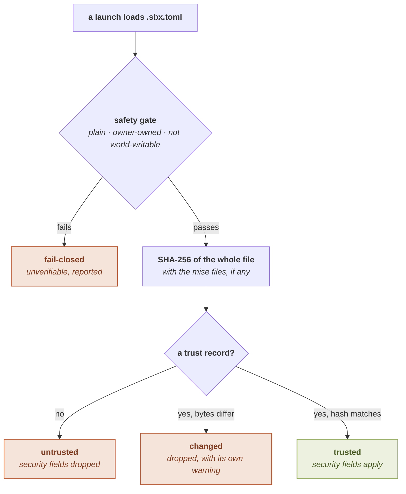

# The trust gate

Security-relevant fields in a project's `.sbx.toml` apply only once you have
**trusted** the file. Trust is bound to the file's *contents*, on the
[direnv](https://direnv.net/) model, so any edit re-arms the gate.

See also: [`sbx trust` / `untrust`](../cli/trust) · [Security model](security-model) · [Configuration overview](../configuration/).

## Free fields vs security fields

The config schema is split by the trust gate, not by two schemas:

| | Free | Closing | Security |
|---|---|---|---|
| Fields | `env` | `[fs]` | `binds`, `network`, `secret`, `packages`, `nixpkgs`, `forward`, `gui`, `gpu`, `audio`, `dbus`, `[proc]`, `[limits]`, `[seccomp]`, `[devices]`, `[ssh_agent]`, `[notify]`, `[task.<name>]`, `[app.<name>]`, `[network.groups]`, `[bundle.<name>]` |
| From an untrusted project | applied (minus a reserved-key denylist) | applied | **dropped**, with a warning |
| From the global config | applied | applied | applied (trusted by location) |
| From a trusted project | applied | applied | applied¹ |

¹ Two are **global-only** rather than merely trusted-only: `[network.groups]` and
`[bundle.<name>]` are ignored from *any* project, trusted or not. They are declared once
where the user owns them, and referenced (`@group`, `use`) from anywhere.

The `env` field is *free* because an untrusted project setting an environment
variable can only harm itself inside the cage: with one exception: a **reserved-key
denylist** blocks loader-control variables (`LD_*`, `NIX_LD`, `GCONV_PATH`, `PATH`,
`HOME`, the proxy-control variables, …) so an untrusted project cannot subvert your
later interactive sessions. See [`env`](../configuration/env).

[`[fs]`](../configuration/fs) is the one *closing* field, and the only one outside the split.
It names project paths the cage may not read or may not write, so every entry **subtracts**
access and there is no syntax for granting any. The gate exists to decide who may widen what
the cage can reach; a table that can only narrow it has nothing for the gate to decide, and
dropping it from an untrusted project would leave open exactly the file that project asked to
close. Layers union, so no layer can reopen what another closed.

Every other field is a *security* field: it changes what the cage can see, reach, or
do, so it is honored only from a trusted source. One nuance worth knowing: `[fs]` closes a
path in **every** cage the session builds, including a declared operation's, and lifting one
for a single task ([`unmask`](../configuration/fs#opening-a-path-for-one-operation)) *is*
gated, because that one does grant.

## Trusted by location vs trusted by content

There are two ways a config is trusted:

- **Trusted by location.** The **global** `sbx.toml`
  ([`~/.config/sbx/sbx.toml`](directory-layout)) and **app profile files** under
  `~/.config/sbx/apps/` are trusted because *you* placed them there. They need no
  `sbx trust`.
- **Trusted by content.** A project `.sbx.toml` is trusted only when you run
  [`sbx trust`](../cli/trust), which records a hash of the file's current bytes.

## How content trust works

`sbx trust` records a **SHA-256 of the whole file** (not a parsed subset) under the
[trust store](directory-layout), keyed by the config's canonical path. When a
launch loads the config, it recomputes the hash of the exact bytes it parses and
compares:

- **Trusted**: the hash matches; security fields apply.
- **Changed**, a trust record exists but the file's bytes differ; security fields
  are dropped, with a warning distinct from the untrusted one (so you know a
  previously-trusted file was edited).
- **Untrusted**: no trust record; security fields are dropped.



Only the `trusted` outcome applies a security field. The free `env` field applies on
all three, minus its reserved keys under the two that are not trusted.

Because the hash covers the *whole file*, any edit, even to a free field, re-arms
the gate. This is deliberate: after editing a trusted file, its security fields stop
applying until you run `sbx trust` again.

When a project also has mise config files (`.mise.toml`, `mise.toml`,
`.tool-versions`, `mise.local.toml`), they are hashed **together** with `.sbx.toml`,
so editing either re-arms the gate and a mise `[env]` cannot change under a trusted
posture without re-trusting.

## Why the whole file

Hashing a parsed subset would let an attacker add a security field a later `sbx`
version understands without changing the recorded subset. Hashing the whole bytes
keeps trust independent of the schema: whatever the file says, if it changed, it must
be re-approved.

## Editing and re-trusting

The config-editing commands warn when an edit re-arms trust and offer to re-trust in
one step:

```sh
sbx config set network ask --trust     # write, then re-trust
sbx config edit --trust                # edit, then re-trust as the editor closes
```

The global config and app profiles are trusted by location, so writing to either
needs no re-trust. See [`sbx config`](../cli/config).

## The safety gate

Before its bytes are read and hashed, a config file must pass a **safety gate**: it
must be a plain, owner-owned, non-world-writable regular file. A file that fails this
is unverifiable and treated fail-closed (the trust command refuses; a launch reports
it untrusted). The same gate protects the open file descriptor whose bytes are then
hashed, so the validated metadata and the consumed bytes are one inode (no
time-of-check/time-of-use window).
