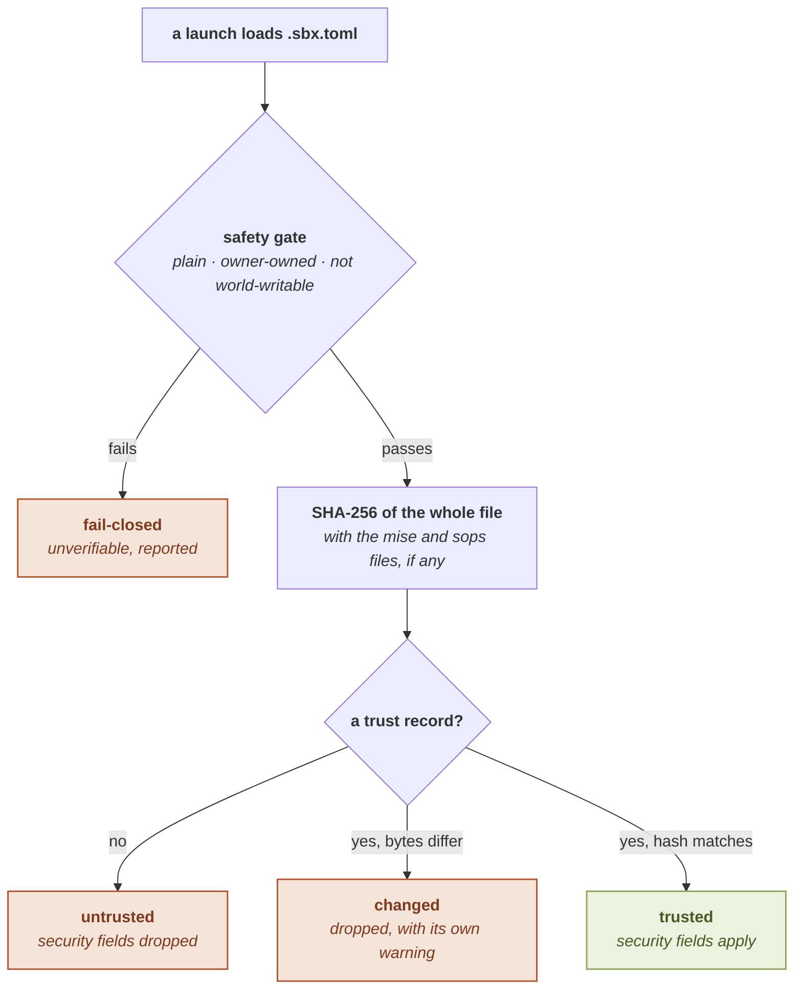

# The trust gate

Security-relevant fields in a project's `.sbx.toml` apply only once you have
**trusted** the file. Trust is bound to the file's *contents*, on the
[direnv](https://direnv.net/) model, so any edit re-arms the gate.

See also: [`sbx trust` / `untrust`](../cli/trust) · [Security model](security-model) · [Configuration overview](../configuration/).

## Free fields vs security fields

The config schema is split by the trust gate, not by two schemas:

| | Free | Closing | Security |
|---|---|---|---|
| Fields | `env`, `timezone` | `[fs]` | every other field: `binds`, `packages`, `network`, `[secret]`, `[proc]`, `[limits]`, `[seccomp]`, `[devices]`, `[ssh_agent]`, `[broker.<name>]`, `[service]`, `[notify]`, `[open]`, `gui`, `gpu`, `audio`, `dbus`, `forward`, `nixpkgs`, `[task.<name>]`, `[app.<name>]`, `[plugin.<name>]`, and the rest of [the field map](../configuration/#the-fields) |
| From an untrusted project | applied (minus a reserved-key denylist) | applied | **dropped**, with a warning |
| From the global config | applied | applied | applied (trusted by location) |
| From a trusted project | applied | applied | applied¹ |
| From a project changed since it was trusted | a launch **stops** until it is re-approved² | | |

¹ Two are **global-only** rather than merely trusted-only: egress groups and tool
bundles are ignored from *any* project, trusted or not. Each is declared once in a file
of its own beside the global config, where the user owns it, and referenced (`@group`,
`use`) from anywhere.

² A project you approved and that changed since, its `.sbx.toml` or a mise or sops file
its trust covers, is not treated as one never approved. Its security fields are held
back, and what would run in their place is the layers below, which are not what it
wrote: it may be what closed its paths or narrowed its network. A launch stops instead,
naming `sbx trust`, which shows what changed before re-approving it. `sbx config show`
and the other read-only verbs still answer, with the fields held back and a line saying
a launch would stop. A project you never approved, or revoked with `sbx untrust`, keeps
the row above: its security fields are dropped and the launch goes on.

The two *free* fields are free for the same reason: neither reads anything from the host,
and neither reaches past the cage the project declares. [`timezone`](../configuration/timezone)
says what clock the cage displays; [`env`](../configuration/env) sets a variable an untrusted
project can only harm itself with, with one exception: a **reserved-key
denylist** blocks loader-control variables (`LD_*`, `NIX_LD`, `GCONV_PATH`, `PATH`,
`HOME`, the proxy-control variables, …) so an untrusted project cannot subvert your
later interactive sessions. See [`env`](../configuration/env).

[`[fs]`](../configuration/fs) is the one *closing* field, and the only one outside the split.
It names project paths the cage may not read or may not write, so every mask **subtracts**
access and there is no syntax for granting any. The gate exists to decide who may widen what
the cage can reach; a mask can only narrow it, so there is nothing for the gate to decide, and
dropping one from an untrusted project would leave open exactly the file that project asked to
close. Layers union, so no layer can reopen a mask another declared.

Two keys of the table widen instead, and they are gated like security fields:
`scan_max_kb`, which lowers how much of a file the content scan reads, and `git_writable`,
which lifts the read-only default sbx itself puts on `.git/hooks/` and `.git/config`. An
untrusted project setting either is refused and told so; a trusted project's appears in the
diff `sbx trust` shows.

Every other field is a *security* field: it changes what the cage can see, reach, or
do, so it is honored only from a trusted source. One nuance worth knowing: `[fs]` closes a
path in **every** cage the session builds, including a declared operation's, and lifting one
for a single task ([`unmask`](../configuration/fs#opening-a-path-for-one-operation)) *is*
gated, because that one does grant.

## Trusted by location vs trusted by content

There are two ways a config is trusted:

- **Trusted by location.** The **global** `sbx.toml`
  ([`~/.config/sbx/sbx.toml`](directory-layout)) and **app profile files** under
  `~/.config/sbx/apps/` are trusted because *you* placed them there. They need no
  `sbx trust`.
- **Trusted by content.** A project `.sbx.toml` is trusted only when you run
  [`sbx trust`](../cli/trust), which records a hash of the file's current bytes.

## How content trust works

`sbx trust` records a **SHA-256 of the whole file** (not a parsed subset) under the
[trust store](directory-layout), keyed by the config's canonical path. When a
launch loads the config, it recomputes the hash of the exact bytes it parses and
compares:

- **Trusted**: the hash matches; security fields apply.
- **Changed**, a trust record exists but the file's bytes differ; security fields
  are dropped, with a warning distinct from the untrusted one (so you know a
  previously-trusted file was edited).
- **Untrusted**: no trust record; security fields are dropped.


```mermaid
flowchart TB
    LOAD["<b>a launch loads .sbx.toml</b>"] --> GATE{"<b>safety gate</b><br/><i>plain · owner-owned · not world-writable</i>"}
    GATE -- "fails" --> CLOSED["<b>fail-closed</b><br/><i>unverifiable, reported</i>"]
    GATE -- "passes" --> HASH["<b>SHA-256 of the whole file</b><br/><i>with the mise and sops files, if any</i>"]
    HASH --> REC{"<b>a trust record?</b>"}
    REC -- "no" --> UNTRUSTED["<b>untrusted</b><br/><i>security fields dropped</i>"]
    REC -- "yes, bytes differ" --> CHANGED["<b>changed</b><br/><i>dropped, with its own warning</i>"]
    REC -- "yes, hash matches" --> TRUSTED["<b>trusted</b><br/><i>security fields apply</i>"]

    classDef hs fill:#F4E4DA,stroke:#B4552F,stroke-width:1.5px,color:#7E3B1F
    classDef cs fill:#EDF1E0,stroke:#8FA557,stroke-width:1.5px,color:#4A5A24
    class TRUSTED cs
    class CLOSED,UNTRUSTED,CHANGED hs
```

Only the `trusted` outcome applies a security field. The free fields apply on all three,
`env` minus its reserved keys under the two that are not trusted.

The key is the directory you are standing in, not the file's target: only the parent
directories are canonicalized, never the final component. A `.sbx.toml` that is a symlink
to another project's config therefore never inherits that project's trust: the decision
stays the property of one directory.

Because the hash covers the *whole file*, any edit, even to a free field, re-arms
the gate. This is deliberate: after editing a trusted file, a launch stops until you run
`sbx trust` again.

## What a re-approval shows

The hash says *whether* the file changed, not *what* changed. So beside each trust record
sits a copy of the bytes it approved, the `.sbx.toml`, every mise file and every sops file
it names, and
`sbx trust` compares the current contents against that copy before recording anything.
It prints the lines that differ, per file, and asks for confirmation; with no copy on
record (a first approval) every line is shown, since all of it is being granted.

This closes the loop the project tree opens. The tree is writable from the cage. A
`.sbx.toml` and the mise files present at launch are mounted read-only inside it, but a
covered file absent at launch is not, so an agent can create one (a `.tool-versions`, a
`.sbx.toml` in a project that had none), and your own edits change the file too. The
next launch stops and says why, `sbx config show` names what is held back (a bind's path,
say), and `sbx trust`, run to lift the stop, shows the changed lines before granting
them. Without the review, the one command the stop suggests would also be the one that
grants the change unseen.

The copy is a display input, never a verdict: whether a project is trusted is the hash
alone. A copy that was tampered with could mislead the diff, but cannot make anything
trusted. Without a terminal, `sbx trust` refuses unless `--yes` is given.

When a project also has mise config files, they are hashed **together** with
`.sbx.toml`, so editing either re-arms the gate and a mise `[env]` cannot change under
a trusted posture without re-trusting. The set is mise's whole same-directory
discovery, in its precedence order:

```
.mise.local.toml  mise.local.toml  .mise.toml  mise.toml
mise/config.toml  .mise/config.toml  .config/mise.toml  .config/mise/config.toml
.tool-versions
```

Three of them sit in a subdirectory of the project, which mise reads exactly as it
reads the top-level ones. What stays out is what lives outside the project root the
gate anchors on: a parent directory's config, the user-global one, and the
env-specific `mise.<env>.toml`.

That is also why a command that **writes and trusts in one step** (`sbx net allow
--local`, `sbx proc allow --local`, `sbx config set --trust`) declines to create a
project's first `.sbx.toml` when a mise file is already sitting beside it: the marker
it would write covers that file too, and sbx will not approve content it did not write
on your behalf. Create the config yourself (`touch .sbx.toml` is enough), review the
mise file, run `sbx trust .sbx.toml`, and the command proceeds. A project with no mise
file bootstraps in one step as before, and so does one whose config you already trust:
there the mise bytes are the ones your existing marker already covers.

## Sops files the config names

A [`sops://`](../secrets/resolvers#sops-a-sops-encrypted-store) source decrypts a file
host-side, and the file's metadata decides where the host's `sops` fetches the key,
with the credentials of your environment. A file in the project is one the cage can
rewrite, so every sops file the `.sbx.toml` names in the project (the file of a
`sops://` reference anywhere in it, and the `file` of a `[secret.defaults.sops]`
table) is hashed **together** with it, like the mise files. A sops file named by an
absolute path outside the project is not. A path counts as the project's when
resolving it passes through the project at any step, as a link into it does, even
where a link left there leads out again: the cage can point that one anywhere.

`sbx trust` shows such a file under `sops:<path>`, ciphertext and metadata, so a
change to the metadata is on screen before it is granted. Re-encrypting or rotating
the file (`sops edit`, `sops updatekeys`) re-arms the gate like any other edit.

At each resolution (the launch, a task run, a credential refresh), sbx re-reads the
file, checks that the project is trusted over those very bytes, and hands `sops` a
private copy of them rather than the path. A file the trust does not cover, or one
rewritten since, is refused before `sops` runs.

A named sops file passes the same [safety gate](#the-safety-gate) as the config, size
ceiling of 1 MiB included. One it refuses makes the project unverifiable, so the
project reads untrusted, and `sbx trust` refuses too: it reads the same file. The
error names the file. Fix it, or keep it outside the project and name it by its
absolute path, which the trust does not hash.

## Why the whole file

Hashing a parsed subset would let an attacker add a security field a later `sbx`
version understands without changing the recorded subset. Hashing the whole bytes
keeps trust independent of the schema: whatever the file says, if it changed, it must
be re-approved.

## Editing and re-trusting

The config-editing commands warn when an edit re-arms trust and offer to re-trust in
one step:

```sh
sbx config set network ask --trust     # write, then re-trust
sbx config edit --trust                # edit, then re-trust as the editor closes
```

The global config and app profiles are trusted by location, so writing to either
needs no re-trust. See [`sbx config`](../cli/config).

## The safety gate

Before its bytes are read and hashed, a config file must pass a **safety gate**: it
must be a plain, owner-owned, non-world-writable regular file. A file that fails this
is unverifiable and treated fail-closed: `sbx trust` refuses it, and a launch refuses to
go on, naming it, rather than applying it or running without it. `sbx config show` sets
the layer aside and says why. The same gate
protects the open file descriptor whose bytes are then hashed, so the validated
metadata and the consumed bytes are one inode (no time-of-check/time-of-use window).

Every surface that reads a config passes the same gate, so they cannot disagree about
which files exist to be acted on: the layers a launch loads, the `@<file>` form of a
[one-shot override](../configuration/overrides), and the files the editing verbs
rewrite. `sbx config set` on a file a launch would drop refuses instead of reporting a
success no launch would honour. The one verb that still opens such a file is
[`sbx config edit`](../cli/config), which hands the path to your `$EDITOR` and never
reads it itself, so a file that has not been vetted stays repairable. Recording trust
afterwards is a separate step and still goes through the gate: `sbx config edit --trust`
opens and saves normally, then warns that it could not trust a file the gate refuses.

One further refusal has nothing to do with the file's bytes and everything to do with its
name. A recorded trust is stored under a name derived from the config's own path, so that
derivation has to tell apart every pair of paths the filesystem tells apart. A path that is
not valid UTF-8 cannot be turned into a distinguishing name without losing exactly the bytes
that distinguish it, and two projects differing only in those bytes would then share one
record. `sbx trust` refuses such a path and says so; reading a verdict for one answers
untrusted, and revoking one answers that it was not trusted.
