# One-shot overrides

A one-shot override changes **any** configuration field for a **single launch**,
without editing a file. It is carried on the command line (or the environment) and is
the **authoritative final word**: it beats a trusted project config *and* an app's own
posture.

See also: [Configuration overview](../configuration/) · [`sbx run`](../cli/run) · [`sbx app`](../cli/app) · [Environment variables](../reference/environment-variables).

## Why it is authoritative (trusted by invocation)

An override comes from the **invoker**, whoever runs `sbx`, whose authority over the
host process's argv and environment no lower-trust context can reach. So it is
**trusted by invocation** (it touches no trust marker) and beats even a trusted project
config or a named app's overlay. This is distinct from the direnv content-trust of a
project config.

## The two surfaces

### Whole-schema blob: `--config` / `SBX_CONFIG`

Inline TOML (or `@<file>`) shaped exactly like an `sbx.toml`, so it can set **any**
field. Repeatable (later wins).

```sh
sbx run --config 'network = "none"' -- ./build.sh
sbx run --config @override.toml -- ./build.sh
SBX_CONFIG='[limits]
tasks_max = 4096' sbx run -- ./build.sh
```

### Typed flags: one field each

Ergonomic shorthands for a single field, each with an `SBX_*` environment equivalent:

| Flag | Environment | Sets |
|---|---|---|
| `--env KEY=VALUE` | `SBX_ENV_<KEY>` | one cage environment variable |
| `--net <posture>` | `SBX_NET` | the network posture (below) |
| `--gui <none\|offscreen\|wayland>` | `SBX_GUI` | the display posture |
| `--proc <off\|observe\|enforce\|ask>` | `SBX_PROC` | the [process/exec](proc) posture (a bare mode) |
| `--notify <off\|once\|always>` | `SBX_NOTIFY` | how loudly a refusal is [announced](notify) (a bare mode) |
| `--nixpkgs <ref>` | `SBX_NIXPKGS` | the nixpkgs channel or revision |
| `--bind <path[:ro\|:rw]>` | `SBX_BIND` | a host bind (read-only by default); repeatable |
| `--forward <port[,port…]>` | `SBX_FORWARD` | host loopback TCP port(s) into the cage; repeatable |
| `--limit <key>=<value>` | `SBX_LIMIT_<key>` | a cgroup limit (`memory_high`/`memory_max`/`tasks_max`) |
| `--package <name>=<backend:locator>` | `SBX_PACKAGE_<name>` | a package |
| `--seccomp <token[,token…]>` | `SBX_SECCOMP` | relax the syscall denylist ([`[seccomp]`](seccomp) grammar); repeatable |
| `--device <path>` | `SBX_DEVICE` | grant a host device node ([`[devices]`](devices)); repeatable |
| `--gpu[=true\|false]` | `SBX_GPU` | the [GPU](gpu) posture (bare `--gpu` means `true`) |
| `--audio[=true\|false]` | `SBX_AUDIO` | the [audio](audio) posture: microphone and playback (bare `--audio` means `true`) |
| `--dbus[=true\|false]` | `SBX_DBUS` | the in-cage [desktop portal](dbus) (bare `--dbus` means `true`) |

```sh
sbx run --net none --limit tasks_max=8192 -- ./build.sh
sbx app run claude-code --net none        # cut the app's network for one run
sbx run --seccomp ptrace -- gdb ./a.out   # relax the denylist for one debug session
sbx run --device /dev/kvm -- ./vm.sh      # grant a device for one run
SBX_NET=none SBX_BIND=/opt/data:ro sbx run
```

#### `--seccomp` / `--device`: relaxing the cage for one launch

A config file gates [`[seccomp]`](seccomp) and [`[devices]`](devices)
**trusted-only** (an untrusted project's is dropped). A one-shot override is **trusted by
invocation**, the person running `sbx` already commands the host process's argv and
environment, and so **outranks any config layer**. So `--seccomp`/`--device` *may* relax the
denylist and grant a device: exactly the relaxation/grant a *trusted config* can already
declare, extended to the more-trusted invoker (parity with the trusted config: not the
`--net`/`--bind` axis). Note relaxing the denylist re-permits a syscall whose only
containment was the filter, widening the **in-cage kernel attack surface**: so a stale
`SBX_SECCOMP` matters more than a stale `SBX_NET` (both print an ambient-source notice).
`--device` takes one path per flag (not comma-split). A bad token or a non-`/dev/` path is
warned and skipped (less relaxation/no device: fail-closed), never fatal. Granting a device
node exposes it; it does not confer a Linux capability, so a device that needs one (a VPN
tun) is not made *usable* this way.

[`[ssh_agent]`](ssh-agent) rides the same parity rule with no flag of its own: there is
no `--ssh-agent`, but a `--config` blob's `[ssh_agent] allow` is honored for one launch and
unions onto the configured grant, like `--device`. An unmatchable entry is warned and
skipped, never fatal.

#### `--proc`: the exec posture for one launch

`--proc` sets only the [exec](proc) **mode** (`off`/`observe`/`enforce`/`ask`), the bare-string
form of the `proc` field. Because an override is trusted by invocation, it may raise, lower, or
**disable** enforcement for one run regardless of the config or app layers: so `--proc off`
turns off a trusted project's `enforce` for a single launch (top authority, the same as
`--gpu=false`), and `--proc enforce` stands enforcement up where a project set none. A mistyped
mode is a **hard error** (like `--gui`/`--net`): keeping the baseline could leave *less*
enforcement than you asked for, a fail-open a security posture must not have.

The one-shot **allow/deny lists** are not on this flag: set them in a `--config` blob's `[proc]`
table (`sbx run --config '[proc]\nmode="enforce"\ndeny=["curl"]' -- …`), or add them live to a
running session with [`sbx proc allow`/`deny --session`](proc). A bare `--proc <mode>` **replaces
the whole policy** (mode *and* any lists), so put the mode and its lists **together in one `--config`
blob**: do **not** split them across `--proc enforce` + `--config '[proc] deny=[…]'`, as the typed
`--proc` beats the blob wholesale and would silently discard the deny list (leaving you with
enforce-*nothing*, a fail-open).

#### `--notify`: how loudly one launch speaks

`--notify` sets one [notification](notify) **mode** (`off`/`once`/`always`) for **every**
event, the bare-string form of the `notify` field. It is the flag for the two moments the
baseline is wrong for the run in front of you: `--notify off` for a batch job whose refusals you
will read in the logs, and `--notify always` to watch a single launch closely when the global
config has gone quiet. A mistyped mode is a **hard error**, like `--proc`: falling back to the
baseline could run the launch *quieter* than you asked, and a refusal nobody hears is what this
feature exists to prevent.

The **per-event table** and `repeat_after` are not on this flag: set them in a `--config` blob's
`[notify]` table:

```bash
sbx run --config '[notify]
mode = "always"
repeat_after = "30s"
[notify.events]
task = "off"' -- ./agent
```

A bare `--notify <mode>` sets **every event's mode** and says nothing about the period, so a
`repeat_after` configured in a file below is **kept**: turning the announcements up for one launch
does not silently remove the spacing that made them bearable.

Within the override itself the ordinary rule still applies: the typed flag replaces a `--config`
blob's `[notify]` table wholesale, period included. So do **not** split one intent across
`--notify always` + `--config '[notify] repeat_after=…'`; put both in the blob.

#### The `--net` posture

`--net` takes `none | shared | ask | allow=h1,h2 | deny=h1,h2`. The `allow=`/`deny=`
DSL builds the common one-shot egress shapes:

- `allow=h1,h2` → a default-**deny** allowlist (only `h1,h2` reach).
- `deny=h1,h2` → a default-**allow** denylist (everything except `h1,h2`).

A bare `allow`/`deny` (no `=`) is **refused as ambiguous**: it reads like the list
forms but would mean the opposite wide-open posture.

#### The `--bind` mode

The mode is the suffix after the **last** `:`, and only when it is exactly `ro` or
`rw`, so `/my:dir` is not mis-parsed as a mode. Read-only by default.

## Precedence: four tiers

Lowest to highest:

```
SBX_CONFIG  <  SBX_* typed (env)  <  --config (cli blob)  <  --* typed (cli)
```

The **command line always beats the environment**, and a **typed flag beats the
blob**. Within that, an override beats the trusted project config and the app overlay.

```mermaid
flowchart LR
    D["<b>built-in defaults</b>"] --> G["<b>global sbx.toml</b><br/><i>trusted by location</i>"]
    G --> P["<b>project .sbx.toml</b><br/><i>security fields only if trusted</i>"]
    P --> A["<b>app overlay</b><br/><i>[app.name] or a profile</i>"]
    A --> E1["<b>SBX_CONFIG</b><br/><i>env blob</i>"]
    E1 --> E2["<b>SBX_* typed</b><br/><i>env</i>"]
    E2 --> C1["<b>--config</b><br/><i>cli blob</i>"]
    C1 --> C2["<b>--* typed</b><br/><i>cli</i>"]

    classDef hs fill:#F4E4DA,stroke:#B4552F,stroke-width:1.5px,color:#7E3B1F
    classDef cs fill:#EDF1E0,stroke:#8FA557,stroke-width:1.5px,color:#4A5A24
    class D,G,P,A cs
    class E1,E2,C1,C2 hs
```



The four highlighted tiers are the override itself, trusted by invocation. Each arrow
means "beats", and what "beating" does depends on the field: a scalar is **replaced**,
a collection is **unioned** (see below).

## The merge rule

One uniform rule across all four tiers:

- **Scalars** (`nixpkgs`, `network`, `gui`, `proc`, `notify`) are **replaced** by the highest
  tier that sets them.
- **Collections** (`env`, `packages`, `binds`, `forward`, `limits`, `seccomp`,
  `devices`) are **unioned**, the higher tier winning per key/entry: so `--bind` *adds*
  to whatever the blobs bound, and `--limit tasks_max=…` tunes one limit without dropping
  a blob's `memory_max`.

## Fail-closed on an invalid value

An override is the final word, so a mistake must never silently launch a *different*
posture:

- A **set-but-invalid** security value (a `--net nonee` typo, a `--gui bogus`, a
  `--proc enfroce`, a `--notify alwyas`, a bad `[limits]` value, a bad `nixpkgs`) is a
  **hard error, exit 2, no launch**. Silently keeping the baseline could leave a *wider*
  posture, or, for `--notify`, a *quieter* one, than the mistyped intent.
- A **structural** error (a `--limit` with no `=`, a `--bind` with an empty path, a bad
  `--net` keyword, an unknown limit key) is likewise a hard error.
- The **additive** fields (`env`/`binds`/`packages`/`forward`/`seccomp`/`devices`) fail
  *closed* by dropping a bad entry (a missing bind or tool, an unknown syscall token, a
  malformed device path: less capability/relaxation, never a wider posture), so they
  warn and skip.

## Environment footgun notice

The environment *can* set security fields, but each security field sourced from the
**environment** prints a stderr notice: guarding against a stale `SBX_NET=shared` in
your shell rc silently widening every launch. The command line is silent (it is
explicit per-invocation).

## What `sbx config show` reflects

`sbx config show` reflects the **ambient** override (the `SBX_*` environment, not the
CLI flags, which are per-command) in the full view, tagging affected values
`(override)`. A set-but-invalid ambient override surfaces as an error note (the
baseline stands for display). So `config show` never lies about what a launch in this
environment would do.

## Residuals

- Overriding an app's `network` drops the app's read-by-default
  [`default_methods`](network#default_methods-apps) → all-verbs (an override posture
  is Mode-A-like). Scope it with `{GET,HEAD}` rules in a `--config` `[network]` if you
  need to keep the read-only default.
- `[net.groups]` and `[app.*]` in an override are ignored with a notice (they are not
  single-launch concepts).
