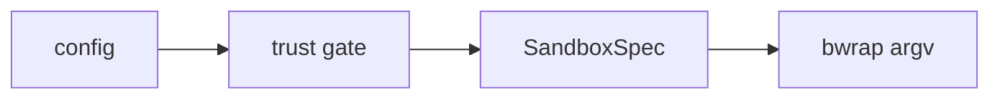

# Installation

`sbx` is a single binary. The shipping artifact is a **static musl binary** with no
runtime dependency on a system libc; a normal `cargo build` also works for
development.

See also: [`sbx doctor` and prerequisites](doctor) · [Quick start](quickstart).

## Runtime prerequisites

Before `sbx` can launch anything it needs:

- **Capability-bearing unprivileged user namespaces**: the security boundary
  everything rests on. Without them there is no boundary, so `sbx doctor`
  **hard-fails** rather than falling back to a weaker mechanism.
- **The bubblewrap engine** (`bwrap`): the sandbox itself. A release can embed its
  own static `bwrap`; otherwise the host's is used.
- **The `nix` binary**: drives the user-owned store. A release can embed its own
  static `nix`; otherwise the host's is used.

Run [`sbx doctor`](doctor) to check all of these at once. On a restricted
Ubuntu 24.04+ host, user namespaces may exist but be stripped of capabilities;
`doctor` checks specifically for the capability-bearing case.

## Development build

For iterating on `sbx` itself:

```sh
cargo build
cargo run -- doctor      # preflight: user namespaces, bwrap, nix, …
```

## Release build (static musl)

Some dependencies carry C/asm, so the musl target is built with
[`cargo-zigbuild`](https://github.com/rust-cross/cargo-zigbuild) (a self-contained
musl cross-cc via zig), wired up through [mise](https://mise.jdx.dev/):

```sh
mise install        # zig + cargo-zigbuild
mise run build      # cargo zigbuild --release --target x86_64-unknown-linux-musl
```

The resulting binary is self-contained and can be copied to another x86_64 Linux
host.

### Self-contained engines (optional)

A release can embed its **own** static `nix` and `bwrap` so it does not depend on
host-installed engines. These are opt-in build features (`bundled-nix`,
`bundled-bwrap`); the default build uses host engines so CI stays lean. When built
this way, `sbx doctor` reports which engine it would use and why. See
[Provisioning](../concepts/provisioning) for how the engines are materialized and
verified.

## Shell completion

`sbx` ships its own completion script, for bash and zsh:

```sh
source <(sbx completion bash)     # this shell only
source <(sbx completion zsh)
```

To install it permanently, and for what does and does not complete, see
[`sbx completion`](../cli/completion).

## Verifying prerequisites

```sh
cargo build && cargo fmt --check && cargo clippy --all-targets -- -D warnings && cargo test
```

The heavy sandbox end-to-end tests skip (rather than fail) when the host lacks user
namespaces, nix, or network: so the suite is green on a constrained CI runner.

## Development tasks

Common tasks are wired through mise:

```sh
mise run fmt             # cargo fmt --check
mise run lint            # cargo clippy --all-targets -- -D warnings
mise run rustdoc         # cargo doc with -D warnings (catches a doc reference that resolves to nothing)
mise run test            # cargo test --no-fail-fast (the whole suite; the sandbox e2e skip where the host cannot sandbox)
mise run coverage        # cargo-llvm-cov coverage report (pass --html for a browsable report)
mise run ci              # fmt + lint + rustdoc + test, as CI runs them
```

The self-contained build has its own pair of tasks:

```sh
mise run build-bundled   # release musl binary WITH the embedded nix + bwrap engines (needs host nix)
mise run lint-bundled    # compile + clippy the bundled-* feature paths (needs host nix)
```

(The `static-nix` / `static-bwrap` steps those depend on are internal, hidden in `mise.toml`.)

## Building the documentation site

The user guide lives in
`docs-site/docs/guide/`
and is built with [Docusaurus](https://docusaurus.io/), configured in
`docusaurus.config.ts`.
Mermaid diagrams render in the browser, from `@docusaurus/theme-mermaid`.

```sh
mise run docs-install   # Node + the pinned npm packages, into docs-site/node_modules
mise run docs           # local preview at http://localhost:3000 (live reload)
mise run docs-build     # strict build into docs-site/build/ (a broken link fails it)
mise run docs-serve     # build, then serve it; the only way to exercise search
```

Search is [Pagefind](https://pagefind.app/), which indexes the built HTML in a
`postbuild` step. There is therefore **no search index under `mise run docs`**:
the field falls back to a disabled input, and `docs-serve` is what shows the real
thing.

A diagram is a fenced block labelled `mermaid`:


