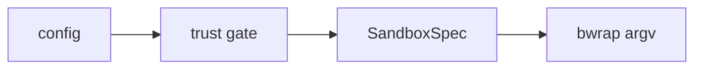

# Installation

`sbx` is a single binary. The shipping artifact is a **static musl binary** with no
runtime dependency on a system libc; a normal `cargo build` also works for
development.

See also: [`sbx doctor` and prerequisites](doctor) · [Quick start](quickstart).

## Runtime prerequisites

Before `sbx` can launch anything it needs:

- **Capability-bearing unprivileged user namespaces**: the security boundary
  everything rests on. Without them there is no boundary, so `sbx doctor`
  **hard-fails** rather than falling back to a weaker mechanism.
- **The bubblewrap engine** (`bwrap`): the sandbox itself. A release can embed its
  own static `bwrap`; otherwise the host's is used.
- **The `nix` binary**: drives the user-owned store. A release can embed its own
  static `nix`; otherwise the host's is used.

Run [`sbx doctor`](doctor) to check all of these at once. On a restricted
Ubuntu 24.04+ host, user namespaces may exist but be stripped of capabilities;
`doctor` checks specifically for the capability-bearing case.

## Running under WSL2

`sbx` runs inside a WSL2 distribution without adaptation. The shipping binary is
static, so the same artifact that runs on a native host runs here once it is copied
into the distribution's own filesystem. Copy it out of `/mnt/c` before running it:
the Windows drive is mounted through `drvfs`, which synthesises permission bits, and
the executable bit does not reliably survive there.

The WSL2 kernel has been observed to provide capability-bearing user namespaces, and it does not carry
the AppArmor restriction that an Ubuntu 24.04 host applies to them, so the boundary
`sbx` rests on is available with no sysctl to set (if that changes, [`sbx doctor`](doctor)
reports it before anything else runs). `bubblewrap` is not part of a
fresh distribution image and is installed from the distribution's own packages.
Install `nix` as the user that will run `sbx` rather than as `root`: run as root,
its single-user installer writes a configuration naming a build group it does not
create, and stops before it has a usable profile.

What differs from a native host is **resource limits**, which are hardening rather
than the boundary and therefore degrade instead of failing:

- A distribution running **systemd** (the default for recent Ubuntu images, set as
  `systemd=true` under `[boot]` in `/etc/wsl.conf`) has a user manager, and the cage
  is capped by a transient scope exactly as on a native host.
- A distribution running **without systemd** has no user session for a scope to be
  registered against, so the cage launches uncapped. This is the documented
  degradation and not a failure: `doctor` reports it, and the namespace, seccomp and
  egress layers are unaffected.

Graphical applications do reach the Windows desktop. WSLg publishes a Wayland socket
in the distribution, `sbx` binds it into the cage under the `wayland` GUI posture, and
a window opened by a caged application appears on the desktop with its own taskbar
entry, like any other window. An X11 application needs an X11 posture rather than the
Wayland one; asking for Wayland and running an X11 binary fails on the display, which
says nothing about the platform.

**WSLg belongs to one Windows session, and it is the session that started WSL first.**
That is the trap worth knowing, because nothing reports it: start the distribution
from a service, a remote shell or a scheduled task outside the desktop session and its
window server attaches there, so applications run with no error and their windows are
drawn where nobody can see them. `wsl --shutdown`, then a launch from the desktop
session, puts it back. The same holds for notifications, which Windows also delivers
per session.

Three further differences are worth knowing before they surprise you:

- **Where you launch from decides what is bound in.** A `wsl` shell opened from
  Windows starts in the Windows user profile under `/mnt/c`, and `sbx run` binds the
  project directory into the cage. Launching from there therefore hands the cage the
  Windows home directory, which is the opposite of what the security model is for.
  Keep projects in the distribution's own filesystem, where the bind is the project
  and nothing above it.
- **Refusals are raised as Windows toasts.** A distribution owns no
  `org.freedesktop.Notifications`, and the desktop these announcements are for is the
  Windows one, so under a WSL kernel `sbx` raises them there instead. It also keeps the
  stderr line: nothing in the toast call reports whether it was seen, because a session
  mismatch, Focus Assist, or a per-application notification setting each swallow one and
  return success. A duplicate line is the price of never announcing a refusal into
  silence. Should a distribution own that bus name after all, the ordinary desktop sink
  wins and neither of these applies.

  The toast carries **PowerShell's** name, and that is a choice rather than an oversight.
  A toast has to be raised under an application id Windows already knows; registering one
  for `sbx` means writing to the Windows registry from Linux, which is a heavier thing to
  do as a side effect of a notification than the wrong name on a banner is to read.

  A toast is drawn in the Windows session the distribution's interop belongs to, which is
  the session that started it. Start the distribution from a service or a remote shell and
  the toasts are drawn where nobody looks; `sbx` compares that session against the
  desktop's and says so once, after the first announcement, rather than leaving it to be
  discovered. `wsl --shutdown` and a launch from the desktop puts them back.
- **GPU acceleration needs the bridge libraries, and `sbx` binds them.** Where the
  Windows host has a GPU that WSL can share, the distribution gets an ordinary
  `renderD*` node and `gpu = true` grants it as it would on any Linux host. The driver
  behind that node is mesa's `d3d12`, which reaches the GPU through `libdxcore.so` and
  `libd3d12core.so`. Windows provides those under `/usr/lib/wsl/lib` rather than nixpkgs
  building them, so a hermetic cage holds the node and renders in software anyway. Under `gpu = true` that directory is bound read-only and put on the cage's
  loader path. Both halves are needed: bound and not on the path, the cage still
  answers `cannot open shared object file`, because a subdirectory of `/usr/lib` is not
  a default search path. A host without that directory is untouched.

- **The light/dark preference comes from Windows, and a later switch is followed.** A
  distribution runs no desktop portal, so the bus name `sbx` reads that preference from
  owns nothing there. Under a WSL kernel it asks Windows instead, through its own
  registry, and seeds the cage with what the desktop is wearing. The two scales are
  opposites and `sbx` reconciles them, so nothing has to be set. A switch made after the
  launch is mirrored as well: Windows raises a notification of its own when that registry
  value is written, so `sbx` waits on it through a single interop process that lives as
  long as the cage, rather than asking again on a timer. An app that reads the preference
  only at startup still opens in whatever it was given, so relaunching is what changes
  such an app. On any other host nothing changes, and nothing is run: the branch is
  reached only by a WSL kernel.
- **No encapsulated storage volume.** A distribution's filesystem is an ordinary
  one, so the store is a plain directory rather than a compressed volume.
  `$SBX_DATA_DIR` can still point `sbx` at a volume that is mounted.

## Running under Lima (macOS)

macOS is not a host `sbx` runs on. The boundary it rests on is a capability-bearing
unprivileged user namespace, macOS has no such thing, and `doctor` hard-fails rather
than falling back to something weaker. What macOS can be is the host a Linux guest runs
on, which is the same arrangement as WSL2 above: the binary that runs is an ordinary
Linux `sbx` in an ordinary Linux kernel, and the Mac is what sits at the end of the
bridges. Nothing in `sbx` is macOS-aware.

The guest comes from [Lima](https://lima-vm.io). This repository ships the template and
a wrapper for it:

```sh
brew install lima
limactl create --name sbx --param projects=Projects dist/macos/sbx.yaml
limactl start sbx
sudo install -m 0755 dist/macos/sbx /usr/local/bin/sbx
```

`--param projects` names the subtree of your home the guest can see, relative to it.
Then `cd` into a project under that subtree and run `sbx` as you would anywhere:

```sh
cd ~/Projects/my-app
sbx run -- npm test
```

**The guest sees one subtree of your home, and that is a deliberate narrowing.** Lima's
own default mounts the whole of `~`. That is the opposite of what `sbx` is for: the
project is writable and nothing above it is in scope at all, so the template mounts one
subtree and asks you to name yours. The mount is writable, because a cage that cannot
write the project is not a sandbox to work in, and that is also what makes the narrowing
worth doing: this mount is the whole of the guest's reach into the Mac's disk.

Four things come from Lima rather than from `sbx`, and none of them needs configuring:

- **The path is the same on both sides.** A mount appears in the guest at the path it has
  on the Mac, so `/Users/you/Projects/my-app` is that path in the guest too, and nothing
  has to be translated.
- **The working directory is carried over.** The wrapper hands the guest the directory
  you were standing in, and `sbx run` builds the cage around it.
- **Resource limits work.** Lima enables lingering for the guest user at boot, so there is
  a user manager for the transient scope to be registered against and the cage is capped
  as it is on a native Linux host.
- **Loopback listeners reach the Mac.** A server a caged process binds on the guest's
  loopback is forwarded, so `localhost` in a Mac browser reaches it.

**The guest and the release drift apart, and a restart is what closes it.** The binary is
installed by provisioning, from the published release, verified against the checksum
published beside it. Lima re-runs provisioning on restart, so `limactl stop sbx && limactl
start sbx` converges the guest on the current build. A guest left running falls behind
instead, and the wrapper says so on stderr once it has been up long enough to matter.

Three smaller things follow from the command crossing an SSH connection rather than being
run locally. Exit codes come back: the wrapper exits with what the caged program exited
with, though a connection failure surfaces as 255, which a program is also free to return.
A terminal is allocated only when the wrapper's own standard output is one, so an
interactive tool behaves differently inside a pipeline here than it does natively. And the
command is run through a login shell in the guest, so the guest's own profile is read
before `sbx` starts.

Three differences from a native host are worth knowing before they surprise you:

- **The window shows the whole guest screen, not one window per application.** With
  `vmType: vz`, Lima opens a native macOS window and draws the guest's framebuffer in it,
  at a fixed 1920 by 1200. A `gui = "wayland"` posture binds the compositor socket of the
  *guest*, exactly as on Linux, so what you need in the guest is a Wayland compositor; the
  window then shows that compositor's screen with the caged application inside it. This is
  not what WSLg does, which publishes each window onto the Windows desktop with its own
  taskbar entry. `sbx` writes no display code either way, and there is no VNC involved.
  X11 is not offered here for the same reason it is not offered anywhere else in `sbx`:
  an X client can snoop and drive every other window on the same display.
- **Sound needs a sound server in the guest.** `audio.device: vz` gives the guest a
  virtio-sound device, which is an ALSA device. The `audio = true` posture binds a
  PulseAudio socket, so a stock cloud image, which runs no sound server in the user
  session, has no socket for it to bind. Install and start one in the guest (PipeWire with
  `pipewire-pulse`, or PulseAudio) and the posture behaves as it does on any Linux host.
- **There is no GPU.** `vmType: vz` presents no GPU to the guest, so `gpu = true` finds no
  render node and falls back to software rendering, which is the documented degradation
  rather than a failure. The scope this template commits to is CLI plus GUI, and the two
  halves cannot currently be had together: the virtio-GPU route that does expose a GPU to a
  Linux guest on Apple Silicon opens no screen. CUDA is out of reach by any route on a Mac,
  because Apple Silicon carries no NVIDIA hardware.

**What of this has been measured.** The template and the wrapper have not been booted:
they were written against Lima's source and its published behaviour, not against a
running guest. [`sbx doctor`](doctor) inside the guest is what decides whether the
boundary is there, and it is the first thing to run after `limactl start`. The
acceptance workflow that would measure all of it on a Mac is in the repository and
requires a self-hosted macOS runner, which is why it reports rather than hangs when none
is registered.

## Development build

For iterating on `sbx` itself:

```sh
cargo build
cargo run -- doctor      # preflight: user namespaces, bwrap, nix, …
```

The compiler is pinned by `rust-toolchain.toml`, so the first `cargo` command in a
fresh clone may download that exact toolchain before it builds anything. That is
deliberate rather than incidental: linting here denies warnings, and each compiler
release adds lints, so a floating compiler turns unchanged code red from one week to
the next. `mise install` provisions the same version, along with the pinned zig that
links the musl build.

## Release build (static musl)

Some dependencies carry C/asm, so the musl target is built with
[`cargo-zigbuild`](https://github.com/rust-cross/cargo-zigbuild) (a self-contained
musl cross-cc via zig), wired up through [mise](https://mise.jdx.dev/):

```sh
mise install        # zig + cargo-zigbuild
mise run build      # cargo zigbuild --release --target x86_64-unknown-linux-musl
```

The resulting binary is self-contained and can be copied to another x86_64 Linux
host. That task builds x86_64 only. A published release carries two assets,
`sbx-linux-x86_64` and `sbx-linux-aarch64`, each built on a runner of its own
architecture; to build the other one here, name its target instead:

```sh
cargo zigbuild --release --target aarch64-unknown-linux-musl
```

### Self-contained engines (optional)

A release can embed its **own** static `nix` and `bwrap` so it does not depend on
host-installed engines. These are opt-in build features (`bundled-nix`,
`bundled-bwrap`); the default build uses host engines so CI stays lean. When built
this way, `sbx doctor` reports which engine it would use and why. See
[Provisioning](../concepts/provisioning) for how the engines are materialized and
verified.

## Shell completion

`sbx` ships its own completion script, for bash and zsh:

```sh
source <(sbx completion bash)     # this shell only
source <(sbx completion zsh)
```

To install it permanently, and for what does and does not complete, see
[`sbx completion`](../cli/completion).

## Verifying prerequisites

```sh
cargo build && cargo fmt --check && cargo clippy --all-targets -- -D warnings && cargo test
```

The heavy sandbox end-to-end tests skip, rather than fail, when the host lacks user
namespaces, nix, or network, so a constrained runner reports skips instead of failures.
`mise run test-cage` turns those skips into failures, for a host that is supposed to be
able to sandbox.

## Development tasks

Common tasks are wired through mise:

```sh
mise run fmt             # cargo fmt --check, for sbx and for proc-shim/
mise run lint            # cargo clippy --all-targets -- -D warnings, for sbx and for proc-shim/
mise run rustdoc         # cargo doc with -D warnings (catches a doc reference that resolves to nothing)
mise run test            # cargo test --no-fail-fast (the whole suite; the sandbox e2e skip where the host cannot sandbox)
mise run audit           # cargo audit against the RustSec advisory database, for both lockfiles
mise run coverage        # cargo-llvm-cov coverage report (pass --html for a browsable report)
mise run ci              # fmt + lint + rustdoc + audit + test, as CI runs them
```

`fmt` and `lint` name `proc-shim/` separately because it is its own workspace root: the
in-cage exec shim must inherit none of sbx's dependency graph, and the cost of that
isolation is that no cargo invocation rooted at the repository reaches it, since `--all`
spans a workspace's members and the shim is not one.

The self-contained build has its own pair of tasks:

```sh
mise run build-bundled   # release musl binary WITH the embedded nix + bwrap engines (needs host nix)
mise run lint-bundled    # compile + clippy the bundled-* feature paths (needs host nix)
```

(The `static-nix` / `static-bwrap` steps those depend on are internal, hidden in `mise.toml`.)

## Building the documentation site

The user guide lives in
`docs-site/docs/guide/`
and is built with [Docusaurus](https://docusaurus.io/), configured in
`docusaurus.config.ts`.
Mermaid diagrams render in the browser, from `@docusaurus/theme-mermaid`.

```sh
mise run docs-install   # Node + the pinned npm packages, into docs-site/node_modules
mise run docs           # local preview at http://localhost:3000 (live reload)
mise run docs-check     # the navigation and imported-recipe checks, without a build
mise run docs-import    # regenerate secrets/providers/ from examples/secrets/
mise run docs-build     # strict build into docs-site/build/ (runs docs-check first)
mise run docs-serve     # build, then serve it; the only way to exercise search
```

The build is strict on purpose, and refuses to finish on any of four things:

- a **broken internal link or anchor**: a page or a heading that does not exist. A link
  to a file *outside* the guide directory (`README.md`, the build config, anything under
  `src/`) has to be a full GitHub URL rather than a relative path, since the site is
  built from `docs-site/docs/guide/` alone.
- a **page nothing routes to**: every page must be named in `sidebars.ts`, sit in a
  directory with an `index.md`, and be linked from both its section index and the guide
  index.
- a **stale imported recipe**: `docs/guide/secrets/providers/` is generated from
  `examples/secrets/*/README.md`. Edit the README, run `mise run docs-import`, and commit
  both.
- **markdown that MDX cannot parse**, most often a bare `<` in prose.

Each error names the page and what it could not resolve.

Search is [Pagefind](https://pagefind.app/), which indexes the built HTML in a
`postbuild` step. There is therefore **no search index under `mise run docs`**:
the field falls back to a disabled input, and `docs-serve` is what shows the real
thing.

A diagram is a fenced block labelled `mermaid`:


