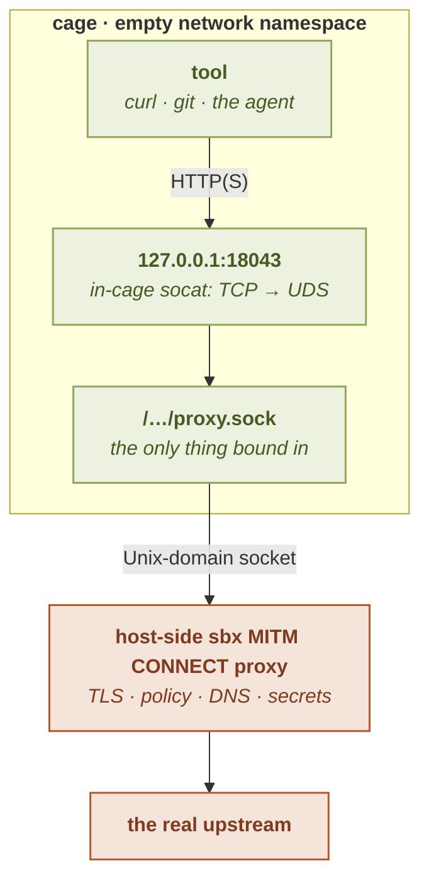

# Architecture: Model B

This page explains how a [filtering egress posture](modes) works under the hood, the
design called **Model B**, and why it holds. It is the *why* behind the
[modes](modes) and [rules](rules) pages.

---

## The shape of it

When the cage runs under `deny`, `allow`, or `ask`:



What the host-side proxy does with each request:

- terminates TLS with a per-session, cage-only CA;
- checks host / port / path / method / regex against the policy;
- requires `CONNECT` authority == SNI == decrypted `Host`;
- resolves DNS host-side, with an SSRF guard on the resolved IP;
- validates the **upstream** certificate against the system trust store;
- injects a `[secret]` header, and redacts secret bytes.

The cage has an **empty network namespace**: loopback and nothing else (with one
nuanced exception, the GUI `dummy0` black-hole interface, described below). The one
path out is a Unix-domain socket bound into the cage's tmpfs; an in-cage `socat`
listens on `127.0.0.1:18043` and forwards to that socket, so tools set the standard
`http_proxy`/`https_proxy` env vars to `127.0.0.1:18043` and comply unchanged. On
the host side of the socket sits the `sbx`-owned MITM CONNECT proxy that does all the
real work.

---

## Why empty netns (fail-closed by construction)

The load-bearing choice is starting from **nothing**. An empty network namespace has
no interface but loopback, no route, and no DNS resolver. A direct `connect()` or DNS
lookup from inside simply fails:

```
ip -o addr        → lo only (127.0.0.1/8, ::1/128)
curl https://cache.nixos.org → Could not resolve host
curl https://1.2.3.4/        → Could not connect
```

The one **GUI-only nuance**: under `gui = "offscreen"` or `gui = "wayland"`,
[`configuration/gui.md#offscreen`](../configuration/gui#offscreen) shows how a small
host-side `__netns-holder` binary (`src/sandbox/netns.rs`) adds a `dummy0`
interface (a kernel black hole, no peer, no route, drops everything) before exec'ing bwrap.
Chromium/Electron decide `navigator.onLine` from the **presence of a non-loopback
interface**, not from actual reachability, so a loopback-only cage reads as "no
network" and a graphical app freezes on *"No internet"* even
though egress works perfectly through the proxy. The dummy flips that to `true` without
opening any egress: a direct `connect()` to any real host still finds no route and
fails closed, and all real traffic still goes through the proxy on loopback. So:

- **CLI / headless cage (`gui = "none"`, the default)**: `lo` only. The above `ip -o addr`
  output is true byte-for-byte.
- **GUI cage (`gui = "offscreen"` / `gui = "wayland"`)**: `lo` + a `dummy0` with the
  private non-routable /24 `10.11.12.0/24`. **No default route** is added, so the
  dummy cannot become an egress path. No DNS resolver is added either; the empty-netns
  property holds.

Why the inverse fallback `lo` only → `lo + dummy0` does **not** re-introduce Model P's
holes: under Model P a NAT uplink leaks the host's loopback and `169.254.169.254` by
default; here the dummy has neither a peer nor a default route, so every cage-side
`connect()` fails as before. The dummy flips Chromium's `navigator.onLine` API, which
keys on interface presence, **not** a real reachability check that Model P would
satisfy.

Nothing leaves the cage unless it goes through the one bound socket. A
misconfiguration, a missing socket, a crashed proxy, fails **closed**: no egress at
all, never accidental open access. This "deny-by-construction, then allow one path"
posture is the opposite of trying to lock down a working general-purpose uplink, and
it is why there is nothing to *remember* to disable.

### Why not Model P (pasta NAT)?

The alternative, **Model P**, gives the cage a real NAT uplink (via `pasta`) and *then*
filters. Three properties rule it out:

- **P leaks by default.** Out of the box a pasta cage reaches the host's own loopback
  services by **two** paths and would reach cloud metadata (`169.254.169.254`).
  Closing it needs a *specific, non-obvious* flag set (`--no-map-gw -T none -U none`);
  the intuitive `--no-splice` is a trap that leaves the direct `127.0.0.1` path open.
  Security depends on getting pasta flags exactly right: a fail-*open* default.
- **P is invasive.** The only fully-unprivileged way to attach pasta is
  `pasta … -- bwrap --share-net …` (pasta as the outer process), which mangles exit-
  status propagation and the interactive shell's pty session leadership.
- **P needs the proxy anyway**, pasta cannot filter by hostname or path, so Model P
  is Model B's work *plus* a NAT topology *plus* a fail-open default.

Model B, by contrast, gets all of that isolation: no route, no DNS, no metadata, no
host-loopback, **for free**, and a misconfiguration fails closed. The failure mode it rules out is
not hypothetical: CVE-2026-47128 is a sandbox without namespaces escaping through
`systemd-run --user`, which an empty network namespace makes unreachable.

---

## The in-cage forwarder (`socat`)

Tools want a `127.0.0.1:PORT` proxy, but the only egress is a Unix socket. A small
in-cage `socat` bridges the two:

```
socat TCP-LISTEN:18043,bind=127.0.0.1,fork,reuseaddr UNIX-CONNECT:/…/proxy.sock
```

It is provisioned by **nix** into the base userland (so its glibc matches the cage's
by construction) and launched by absolute store path. The launched command runs as
the cage's main process, so `sbx run`'s job control is unchanged, and no forwarder
lingers after the command exits (the cage's PID-1 reaper tears the netns down).

Security does **not** depend on the forwarder's integrity: it is pure ergonomics.
Bypassing it just means talking to the same allowlisting socket directly or losing
egress; either way the boundary is the empty netns plus the host proxy, not `socat`.
The cage's own loopback (`127.0.0.1`, `::1`) is exempt from the proxy (`no_proxy` is
set): it is intra-cage traffic under the empty netns, never egress.

---

## The host proxy: what each step enforces

The host-side MITM CONNECT proxy is where the policy is enforced. On each connection:

### Host-side DNS (no DNS exfil)

The cage cannot resolve names: it has no resolver. A `CONNECT host:port` carries the
**hostname**, and the *proxy* resolves it, host-side. So the cage never sees a name to
smuggle data through a DNS query, and the policy matches on the name the tool asked
for, not on a resolved IP the cage could rebind. This closes DNS-based exfiltration by
construction.

### The TLS-terminating MITM (path/URL granularity)

A plain CONNECT proxy only sees `host:port` for an HTTPS tunnel: the path is inside
the encrypted stream. To enforce path-, URL-, method-, and regex-level rules (and to
inject/redact secrets), the proxy **terminates the TLS**: it presents a leaf
certificate for the requested host, signed by a **per-session CA** that is trusted
**only inside the cage** (never added to the host trust store; the CA's private key is
owner-only and ephemeral). It decrypts, applies the policy, and re-encrypts to the
upstream. This is the capability that makes an *exact-URL* rule possible, and it is transparent to
ordinary clients: `nix` and `curl` both fetch cleanly through it once the cage trusts the CA.

A [`tcp://` L4 rule](rules#raw-l4-splice-tcp) opts out of this: the proxy splices the
raw byte stream without terminating TLS, for non-HTTP protocols. That is why a raw
splice has no path/method controls and bypasses the credential machinery.

### What the cage's trust anchor holds

The CA the cage trusts is at `/opt/sbx/egress-ca.pem`, written owner-only outside every
writable mount and bound read-only, so the agent cannot rewrite its own anchor. What the
file contains follows from the question the previous paragraph raises: can anything in
this cage reach a server the proxy does not stand in for?

With every rule inspected, no. The proxy terminates each connection and presents its own
leaf, so the session CA is the only anchor a client ever exercises. Add a `tcp://` rule
and the answer changes: a spliced stream reaches the real server, the client
authenticates it, and the ordinary public roots are what lets it.

By default the file carries the session CA followed by the host's root bundle in both
cases. Under an all-inspected policy those roots verify nothing, and they are kept for a
different reason: a trust store holding a single certificate is an unusual file, and a
client that sanity-checks its shape rejects it outright. That failure is cryptic, since
the client blames the bundle rather than the sandbox, and it takes the whole tool down
rather than one request.

The roots are not free. The full bundle is about 460 KB and 120 certificates, and a
client that loads its trust store on each connection reads all of it: in a cage, `curl`
spent about 13 ms in its TLS phase against about 1.3 ms on the session CA alone. That is
the largest single cost on the inspected path.

[`[network] ca_roots = false`](../configuration/network#the-cage-trust-anchor-ca_roots)
buys it back for a cage whose tools are known not to make that check. It is a preference,
not an override: where the policy carries a `tcp://` rule the roots are load-bearing, so
they stay and the launch says so in a warning.

### Requests that arrive without a CONNECT

Not every client tunnels. With a proxy configured, some send the whole request to the
proxy in **absolute form**, `POST https://host/path HTTP/1.1`, and expect the proxy
to make the outbound TLS connection itself (the "secure web proxy" shape some bundled
proxy libraries use). The proxy serves that too, under the **ordinary `https` policy**:
no separate opt-in, no new rule syntax: an `allow` that covers the host covers this
request exactly as it would cover the equivalent `CONNECT`, `ask` parking included.
Everything below applies unchanged (host identity, SSRF guard, upstream validation,
credential injection and redaction), and the connection sbx opens to the real upstream
is still a **validated TLS** one.

What differs is only the *client* leg: that request, and the response, travel in
cleartext between the tool and the proxy. That leg is a loopback socket **inside the
cage**, which no process in the cage can read (there is no `CAP_NET_RAW` for a packet
socket, and `ptrace` is on the [seccomp denylist](../concepts/enforcement)), and an
injected credential is added by the proxy for the upstream leg only: it never appears
on the client leg at all. Nothing leaves the cage unencrypted on this path.

Under [`ask`](ask) such a request parks like any other, answerable with `sbx net
pending`. Worth knowing: a client that reached the proxy this way is usually a library
with its own request timeout, so it may give up before you answer: set
[`ask_timeout`](ask#tuning-ask-table-fields) to bound the wait, or pre-allow the
host.

An absolute-form **`http://`** request is a different thing: that one is genuine
cleartext all the way to the origin server, and stays [strictly
opt-in](rules#cleartext-http-http) behind an explicit `http://` rule.

### Message framing (where a request and a response end)

Terminating TLS means the proxy has to decide, for every message, where it ends. It
does that from the message itself rather than from the socket, in both directions, and
the two directions are deliberately not symmetric.

**Outbound, the rule is fail-closed.** Ambiguous framing is the classic
request-smuggling vector, so a request that carries a duplicated `Content-Length` or
`Host`, or a `Transfer-Encoding` whose coding is anything but `chunked`, is refused
outright (`400 bad-request`, sub-categorized in the logs). A well-formed `chunked`
request is not refused: it is de-chunked into a bounded buffer and re-framed with a
synthesized `Content-Length`, so exactly one unambiguous framing reaches the upstream.

An inspected request is also **written out again** rather than forwarded byte for byte,
which is what makes the proxy's own reading of it the one the upstream sees. For that to
hold, no header may carry a byte a different parser would break a line on, so a control
byte in a request line, a header name or a header value is refused as
`bad-request:control-char`. The rule is the one HTTP/2 enforces by construction: a byte
must be a tab, visible ASCII, or above ASCII. Without it a single carriage return inside
a header value reaches a lenient upstream as a header of the caller's own choosing,
including one placed in front of a credential the proxy strips and replaces.

**Inbound, the rule is fail-open.** The proxy reads the response head, then applies the
standard delimitation rules in order:

| The head says | The body is |
|---|---|
| `1xx`, `204`, `304`, or the request was a `HEAD` | **empty**, whatever length it declares |
| `Transfer-Encoding` ending in `chunked` | the chunks, to the terminal one |
| `Content-Length: N` | exactly `N` bytes |
| anything else, or anything ambiguous | whatever arrives until the upstream closes |

The first row is the one that matters in practice: a `304` answering a conditional
`GET` routinely carries a `Content-Length` describing the entity it did *not* send, and
so does a response to `HEAD`. The status decides, not the length.

The last row is the deliberate asymmetry. Where an ambiguous *request* is refused, an
ambiguous *response* is relayed to the close. Cutting it would turn an upstream's
framing bug into a truncation the tool in the cage would blame on sbx. Framing can
shorten the wait; it never shortens a response.

A chunked response reaches the cage **verbatim**, size lines and trailers included. The
proxy learns where the body ends without rewriting a byte of it.

### Reusing a connection (`pool`)

Framing is what makes reuse possible: a proxy that cannot tell the end of a message
from the end of a socket has to close the socket to know it is done. Once it can, a
finished connection is a working session the next request could use instead of paying
for another handshake. With
[`[network] pool = true`](../configuration/network#reusing-connections-pool) it does,
on both of a forwarded request's legs, and it is on by default. `pool = false` turns it
off.

Reuse never touches the verdict. Every request is checked in full, exactly as it is
without it: the allowlist, the `Host`/SNI agreement, the address guard, the secret
tripwires. What is reused is the handshake.

**The two legs are independent, and that is the load-bearing part.** Whether the
connection to the real server is held for another request, and whether the cage's tunnel
is, are two questions with two answers; the `Connection` header is per-hop precisely so a
proxy can answer them separately. Passing the upstream's answer through as if it were the
client's would invite the client to send its next request into a tunnel already closing.

#### The upstream leg

A connection to the real server is offered to another request only when all of these
hold:

| Condition | Why |
|---|---|
| same host and port | the certificate was validated for that name |
| same injected credentials | a connection that carried a secret is never given to a request that does not receive the same one |
| the body ended where its framing said | a truncated message leaves the connection at an unknown position |
| nothing arrived after it | anything else means the connection has moved past that message |
| the response announced no close, and no `NTLM`/`Negotiate` | those bind an identity to the connection itself |

Anything else closes. What is held is bounded by **count**, not by a clock: 64 waiting
connections in total, 4 per host and credential set, the same stance the rest of the
proxy takes toward held resources. The clock answers a different question, which is how
stale a connection may be and still be handed over: one that has waited more than 10
seconds is dropped rather than reused.

There is one more condition, on the *taking* side rather than the offering one: a
request may only ride a waiting connection if it could be sent again. A server that
closed while its connection sat idle only reveals it after the write, and a body that
streamed straight through from the caller is gone by then. So a request with no body,
or one whose body the proxy holds in memory, may take a parked connection; one whose
body streams opens its own, and still leaves it behind for the next request.

That is why a **small declared body is read into memory** even when nothing else asked
for it. Holding it costs a copy and buys back a whole TLS handshake, so the proxy does
it up to a few hundred kilobytes and streams anything larger, where the copy would cost
more than the handshake saves. A `chunked` body is already read this way, to be re-framed
with a length the upstream can trust, so it has always been eligible.

The residual is a server closing a waiting connection in the microseconds between the
proxy's check and its write. That request gets a `502 upstream-closed`, never a silent
empty response.

#### The client leg

An intercepted tunnel carries requests until one of them leaves it unusable. This is what
an ordinary HTTP client already expects: its connection pool opens one `CONNECT` and sends
request after request down it. It is also where the larger saving is, because the handshake
it removes is the one the proxy performs with the cage rather than the one it performs with
the server.

It is also where the checking has to be exactly right, so the shape of the code is the
guarantee rather than the discipline. Serving one request is a single function with
nothing carried in from the request before it: the credential snapshot, the `Host` and SNI
agreement, the control-byte and framing refusals, the verdict, the resolution, the address
guard, the outbound tripwire, the injection match, the capture and the counters all start
again. That function has one exit that says *carry another request*, its last line, and
every other way out of it closes the tunnel. A refusal closes because its request body was
never read, so where the client's stream sits is no longer known.

Pipelining follows from that rather than being a feature: a second request the client sent
before the first response came back is read as its own turn, so it is decided on its own
`Host`, path and method. Nothing about the first request reaches it.

The tunnel is offered another request only when all of these hold:

| Condition | Why |
|---|---|
| the client's own request left it open | an `HTTP/1.0` request, or one carrying `Connection: close`, said this was its last |
| the response is delimited by a length or by chunks | a body the client finds the end of by watching for the close cannot be followed by anything |
| the body ended where its framing said, with nothing after it | the same rule as the upstream leg, and for the same reason |
| the upstream announced no close, and no `NTLM`/`Negotiate` | a response that ends its own leg ends this one |

What the client is told is sbx's own answer, never the upstream's: the `Connection` and
`Keep-Alive` headers a server sent describe the server's socket, and are replaced rather
than relayed. A tunnel that has answered a request and is waiting for the next is closed
after ten idle seconds by default, the same bound the upstream leg uses and for the same
reason: a client that has another request to send has already decided to. One that comes
back later simply opens a tunnel again.
[`[network] idle_timeout`](../configuration/network#how-long-a-connection-is-kept-idle_timeout)
moves that bound, on both legs at once, since it is one question asked twice.

#### How many connections at a time

The proxy serves a bounded number of client connections at once, and refuses a further one
with a `503` naming `connection-cap` rather than queueing it. What it bounds is the host
threads and descriptors an in-cage caller can tie up, including a caller that opens
connections faster than they complete and one that abandons a tunnel mid-idle. A tunnel
that serves several requests holds one connection for all of them, so the bound counts
callers rather than requests.
[`[network] max_connections`](../configuration/network#how-many-connections-at-once-max_connections)
moves it. The refusal is answered before anything is read, so it reaches the caller
followed by a connection reset: an HTTP client reads the response and reports it, which is
the point, since a dropped connection would have said nothing at all.

**On the HTTP/2 plane it is sharing rather than take-and-return.** HTTP/2 multiplexes,
so a connection there is handed to every stream that may use it at once and none of them
gives it back; it lives as long as the tunnel that opened it. The key keeps its
load-bearing half, the injected credential set, so a connection that carried a
credential is still never offered to a stream that does not receive the same one. What
does not carry over is the re-sendability condition, and for a good reason: on this
plane the proxy learns a connection is stale *before* the request is handed to it, so a
stale one costs the stream only the handshake it was trying to save. Everything a stream
is checked for happens before any of this: the `:authority` re-check, the outbound
tripwire, the verdict, the resolution and the address guard all run per stream, and one
that any of them refuses never reaches the connection at all.

`pool = false` turns reuse off on both planes alike.

### CONNECT authority == SNI == decrypted Host (anti-domain-fronting)

Domain fronting is connecting to one host at the TCP/TLS layer while addressing a
*different* host at the HTTP layer, to slip a request past a host allowlist. The proxy
refuses it: the **CONNECT authority**, the TLS **SNI**, and the decrypted HTTP
**Host** header must all name the same host, or the request is refused (`421`). One
consistent identity is checked against the policy: you cannot allow `a.example.com`
and be fronted to `b.example.com`.

### The SSRF guard

The proxy runs on the host with full network reach, so an allowlisted *hostname* (or a
rebound DNS answer for it) resolving to an **internal** address would be a
server-side-request-forgery vector. After resolving, the proxy classifies the target
IP: a public address is reachable subject to policy; a **private/loopback/CGNAT**
address is refused **unless** the deciding rule names that *exact* host (an explicit
IP-literal or exact-host allow: a deliberate internal target). A `*.domain`, regex,
or built-in match does not grant the internal exception, and **cloud-metadata and
link-local** addresses are *always* refused (no exception, ever). A v4-mapped-v6
address is unwrapped first, so the guard cannot be dodged by an alternate encoding.

### Fail-closed upstream validation

Terminating TLS must not *downgrade* transport security. Before relaying, the proxy
opens its **own** TLS connection to the real upstream and validates that certificate
against the **system trust store**. A forged or self-signed upstream is refused
(`502`), never relayed. So the cage-only CA lets the proxy inspect the request, but
the connection to the real world is still fully validated: the MITM adds inspection
without weakening the chain.

### Credential injection and redaction

Because the L7 path decrypts the request, it is also where a
[`[secret]` credential is injected](../secrets/injection) into an allowed request, host-side, after the verdict, so the plaintext never enters the cage, and where the
[outbound and inbound secret tripwires](../secrets/redaction) run. These are a
separate subsystem documented under [Secrets](../secrets/); they ride the
same proxy the egress policy runs on, which is why they are inert on a `tcp://` splice
(no request head to inspect).

---

## Refusal reasons

Every refusal the proxy issues carries a stable reason category (an
`X-Sbx-Egress-Reason` header plus a short body), so an agent can tell an explicit
policy refusal from a host that does not respond from a name that does not resolve.
The categories surface in [`sbx net logs`](observability#sbx-net-logs) as the
per-event reason: `denied-default`, `denied-by-rule` (categorical: the rule text is
never disclosed, so a global-config rule the cage cannot read does not leak),
`denied-method`, `ssrf-blocked`, `host-mismatch`, `ip-literal`, `bad-request`,
`outbound-secret`, `signer-refused`, `signer-body-too-large`, `body-buffer-cap`,
`connection-cap`, `injected-header-invalid`, and the transport-side `dns-failure`, `upstream-unreachable`,
`upstream-cert-rejected`, `upstream-http2-unsupported`, and `upstream-closed`. A genuine
upstream status (a real `404`) is relayed verbatim with no such header.

`upstream-http2-unsupported` belongs to a host designated
[`http2`](../configuration/network#http2-and-grpc) alone: gRPC is HTTP/2 end to end and the
proxy does not translate, so a host that will not speak it fails closed rather than
being downgraded. A server says so in either of two ways, by refusing the protocol
offer during the handshake or by ignoring it and negotiating nothing, and both arrive
under this reason. Neither is a certificate problem, and reading one as
`upstream-cert-rejected` would send you after the one thing that is not wrong.

A transport failure is also *recorded*, not only answered, and where it fell is what a
reader sees. A host that was never reached leaves one `error` line carrying the reason
and no allow at all, since nothing was allowed to leave. A host that was reached and
then closed before answering leaves the allow standing, its status blank, with an
`upstream-closed` beside it. The two reasons are the difference between a host that is
down and a call that was lost mid-flight, so they are never used for each other.

`signer-refused` is the one that is not a policy verdict: the policy allowed the host,
and the request was refused because its credential could not be formed. See
[`sign`](../configuration/secret#sign-a-credential-computed-from-the-request). Its body
names the plugin and repeats the plugin's own reason, because a refusal that does not
say who refused leaves every declaration to audit.

`signer-body-too-large` is its neighbour, and no plugin refused it: a signer whose
manifest asks to be told a digest over the request body needs sbx to hold that body,
and this request declares a `Content-Length` larger than the buffer it holds. It
answers `413`, from the head, before the client is invited to send. An over-cap
`chunked` body declares no length and is discovered while being read, so it keeps the
`bad-request:chunked` above. See
[what a signer is told about the body](../secrets/plugins#what-a-signer-is-told-about-the-body).

`body-buffer-cap` says nothing is wrong with the request. Some requests have their body
read into memory before being forwarded: a `chunked` one, which is de-chunked and re-framed,
and one whose destination has a signer that asks to be told a digest of it. That buffer is
bounded per request, but the proxy runs host-side, outside the cage's own memory ceiling, so
the *sum* of them is bounded too. When that shared ceiling is reached a further such request
is answered `503` and is not sent; it succeeds once one in flight completes. A request whose
body streams through is never affected.

That makes it the opposite of its neighbour above, and the two are decided in that order.
`signer-body-too-large` is permanent: no amount of waiting makes a body larger than the
per-request buffer fit. `body-buffer-cap` is transient by definition. So a declared length
above the per-request ceiling is answered `413` at every size, including sizes far past the
shared budget, rather than being turned away with a retry that could never succeed.

`upstream-closed` is the one that names a server that accepted the request and then
went away without answering. Saying so is deliberate: an empty relay would be
indistinguishable from a genuine zero-byte response, and it is also where the one
residual of [connection reuse](#reusing-a-connection-pool) would surface.

Every one of these is a **request-side** category: they describe requests the proxy
declined to make. No response is ever refused for how it is framed, per the inbound
rule above.

---

## Honest scope

The boundary is the **empty netns + the allowlist + the host proxy**. Model B closes
direct egress, DNS exfil, host-loopback and metadata reach, and (via the MITM)
enforces path/method/regex granularity with per-session isolation. What it does
**not** claim: the byte-exact secret tripwires are backstops, not a complete
data-loss-prevention system (an encoded or split secret evades a byte match); a
`tcp://` splice is uninspected by design; and the same-uid model means the network is
one control among several: the [bind layout](../concepts/security-model), not the
network alone, is what keeps host secrets out of the cage.

---

## See also

- [Egress overview](../networking/): the one-paragraph summary and the mode table.
- [Network modes](modes): the postures this architecture serves.
- [Rule grammar](rules): L7 vs L4, and what the MITM path enforces.
- [Observability](observability): the `blocked`/`error` verdicts and reason
  categories this page's guards produce.
- [Secrets architecture](../secrets/): injection and redaction over this
  same proxy.
- [Security model](../concepts/security-model) · [Enforcement stack](../concepts/enforcement) · [Configuration: `gui`](../configuration/gui) (the GUI dummy0 nuance above)
