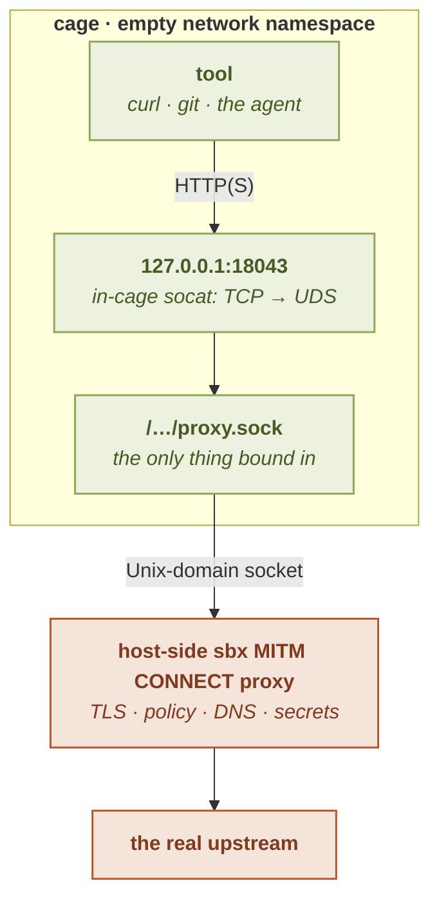

# Architecture: Model B

This page explains how a [filtering egress posture](modes) works under the hood, the design called **Model B**: and why it was chosen. It is the *why* behind the
[modes](modes) and [rules](rules) pages. For the full evidence (a throwaway
spike that tested both architectures live). The decision is documented in the
**M6/M7 surge** alongside the egress design (see the threat model's egress section).

---

## The shape of it

When the cage runs under `deny`, `allow`, or `ask`:



What the host-side proxy does with each request:

- terminates TLS with a per-session, cage-only CA;
- checks host / port / path / method / regex against the policy;
- requires `CONNECT` authority == SNI == decrypted `Host`;
- resolves DNS host-side, with an SSRF guard on the resolved IP;
- validates the **upstream** certificate against the system trust store;
- injects a `[secret]` header, and redacts secret bytes.

The cage has an **empty network namespace**: loopback and nothing else (with one
nuanced exception, the GUI `dummy0` black-hole interface, described below). The one
path out is a Unix-domain socket bound into the cage's tmpfs; an in-cage `socat`
listens on `127.0.0.1:18043` and forwards to that socket, so tools set the standard
`http_proxy`/`https_proxy` env vars to `127.0.0.1:18043` and comply unchanged. On
the host side of the socket sits the `sbx`-owned MITM CONNECT proxy that does all the
real work.

---

## Why empty netns (fail-closed by construction)

The load-bearing choice is starting from **nothing**. An empty network namespace has
no interface but loopback, no route, and no DNS resolver. A direct `connect()` or DNS
lookup from inside simply fails:

```
ip -o addr        → lo only (127.0.0.1/8, ::1/128)
curl https://cache.nixos.org → Could not resolve host
curl https://1.2.3.4/        → Could not connect
```

The one **GUI-only nuance**: under `gui = "offscreen"` or `gui = "wayland"`,
[`configuration/gui.md#offscreen`](../configuration/gui#offscreen) shows how a small
host-side [``__netns-holder` binary](https://github.com/gigi206/ops-cli/blob/ops-v2/src/sandbox/netns.rs) adds a `dummy0`
interface (a kernel black hole, no peer, no route, drops everything) before exec'ing bwrap.
Chromium/Electron decide `navigator.onLine` from the **presence of a non-loopback
interface**, not from actual reachability, so a loopback-only cage reads as "no
network" and a graphical app freezes on *"No internet"* even
though egress works perfectly through the proxy. The dummy flips that to `true` without
opening any egress: a direct `connect()` to any real host still finds no route and
fails closed, and all real traffic still goes through the proxy on loopback. So:

- **CLI / headless cage (`gui = "none"`, the default)**: `lo` only. The above `ip -o addr`
  output is true byte-for-byte.
- **GUI cage (`gui = "offscreen"` / `gui = "wayland"`)**: `lo` + a `dummy0` with the
  private non-routable /24 `10.11.12.0/24`. **No default route** is added, so the
  dummy cannot become an egress path. No DNS resolver is added either; the empty-netns
  property holds.

Why the inverse fallback `lo` only → `lo + dummy0` does **not** re-introduce Model P's
holes: under Model P a NAT uplink leaks the host's loopback and `169.254.169.254` by
default; here the dummy has neither a peer nor a default route, so every cage-side
`connect()` fails as before. The dummy flips Chromium's `navigator.onLine` API, which
keys on interface presence, **not** a real reachability check that Model P would
satisfy.

Nothing leaves the cage unless it goes through the one bound socket. A
misconfiguration, a missing socket, a crashed proxy, fails **closed**: no egress at
all, never accidental open access. This "deny-by-construction, then allow one path"
posture is the opposite of trying to lock down a working general-purpose uplink, and
it is why there is nothing to *remember* to disable.

### Why not Model P (pasta NAT)?

The rejected alternative, **Model P**, gives the cage a real NAT uplink (via `pasta`)
and *then* filters. The spike settled it decisively against P:

- **P leaks by default.** Out of the box a pasta cage reaches the host's own loopback
  services by **two** paths and would reach cloud metadata (`169.254.169.254`).
  Closing it needs a *specific, non-obvious* flag set (`--no-map-gw -T none -U none`);
  the intuitive `--no-splice` is a trap that leaves the direct `127.0.0.1` path open.
  Security depends on getting pasta flags exactly right: a fail-*open* default.
- **P is invasive.** The only fully-unprivileged way to attach pasta is
  `pasta … -- bwrap --share-net …` (pasta as the outer process), which mangles exit-
  status propagation and the interactive shell's pty session leadership.
- **P needs the proxy anyway**, pasta cannot filter by hostname or path, so Model P
  is Model B's work *plus* a NAT topology *plus* a fail-open default.

Model B, by contrast, gets all of that isolation: no route, no DNS, no metadata, no
host-loopback, **for free**, and a misconfiguration fails closed. That is why it was
chosen (and confirmed with the user). The CVE-2026-47128 incident (in the namespace-free, Landlock-first cohort we surveyed): a no-namespace
setup escaping via `systemd-run --user`: is a live validation of the all-namespaces,
empty-netns approach.

---

## The in-cage forwarder (`socat`)

Tools want a `127.0.0.1:PORT` proxy, but the only egress is a Unix socket. A small
in-cage `socat` bridges the two:

```
socat TCP-LISTEN:18043,bind=127.0.0.1,fork,reuseaddr UNIX-CONNECT:/…/proxy.sock
```

It is provisioned by **nix** into the base userland (so its glibc matches the cage's
by construction) and launched by absolute store path. The launched command runs as
the cage's main process, so `sbx run`'s job control is unchanged, and no forwarder
lingers after the command exits (the cage's PID-1 reaper tears the netns down).

Security does **not** depend on the forwarder's integrity: it is pure ergonomics.
Bypassing it just means talking to the same allowlisting socket directly or losing
egress; either way the boundary is the empty netns plus the host proxy, not `socat`.
The cage's own loopback (`127.0.0.1`, `::1`) is exempt from the proxy (`no_proxy` is
set): it is intra-cage traffic under the empty netns, never egress.

---

## The host proxy: what each step enforces

The host-side MITM CONNECT proxy is where the policy is enforced. On each connection:

### Host-side DNS (no DNS exfil)

The cage cannot resolve names: it has no resolver. A `CONNECT host:port` carries the
**hostname**, and the *proxy* resolves it, host-side. So the cage never sees a name to
smuggle data through a DNS query, and the policy matches on the name the tool asked
for, not on a resolved IP the cage could rebind. This closes DNS-based exfiltration by
construction.

### The TLS-terminating MITM (path/URL granularity)

A plain CONNECT proxy only sees `host:port` for an HTTPS tunnel: the path is inside
the encrypted stream. To enforce path-, URL-, method-, and regex-level rules (and to
inject/redact secrets), the proxy **terminates the TLS**: it presents a leaf
certificate for the requested host, signed by a **per-session CA** that is trusted
**only inside the cage** (never added to the host trust store; the CA's private key is
owner-only and ephemeral). It decrypts, applies the policy, and re-encrypts to the
upstream. This is the capability that makes an *exact-URL* rule possible; the spike
proved that nix and curl both fetch cleanly through it once the cage trusts the CA.

A [`tcp://` L4 rule](rules#raw-l4-splice-tcp) opts out of this: the proxy splices the
raw byte stream without terminating TLS, for non-HTTP protocols. That is why a raw
splice has no path/method controls and bypasses the credential machinery.

### Requests that arrive without a CONNECT

Not every client tunnels. With a proxy configured, some send the whole request to the
proxy in **absolute form**, `POST https://host/path HTTP/1.1`, and expect the proxy
to make the outbound TLS connection itself (the "secure web proxy" shape some bundled
proxy libraries use). The proxy serves that too, under the **ordinary `https` policy**:
no separate opt-in, no new rule syntax: an `allow` that covers the host covers this
request exactly as it would cover the equivalent `CONNECT`, `ask` parking included.
Everything below applies unchanged (host identity, SSRF guard, upstream validation,
credential injection and redaction), and the connection sbx opens to the real upstream
is still a **validated TLS** one.

What differs is only the *client* leg: that request, and the response, travel in
cleartext between the tool and the proxy. That leg is a loopback socket **inside the
cage**, which no process in the cage can read (there is no `CAP_NET_RAW` for a packet
socket, and `ptrace` is on the [seccomp denylist](../concepts/enforcement)), and an
injected credential is added by the proxy for the upstream leg only: it never appears
on the client leg at all. Nothing leaves the cage unencrypted on this path.

Under [`ask`](ask) such a request parks like any other, answerable with `sbx net
pending`. Worth knowing: a client that reached the proxy this way is usually a library
with its own request timeout, so it may give up before you answer: set
[`ask_timeout`](ask#tuning-ask-table-fields) to bound the wait, or pre-allow the
host.

An absolute-form **`http://`** request is a different thing: that one is genuine
cleartext all the way to the origin server, and stays [strictly
opt-in](rules#cleartext-http-http) behind an explicit `http://` rule.

### CONNECT authority == SNI == decrypted Host (anti-domain-fronting)

Domain fronting is connecting to one host at the TCP/TLS layer while addressing a
*different* host at the HTTP layer, to slip a request past a host allowlist. The proxy
refuses it: the **CONNECT authority**, the TLS **SNI**, and the decrypted HTTP
**Host** header must all name the same host, or the request is refused (`421`). One
consistent identity is checked against the policy: you cannot allow `a.example.com`
and be fronted to `b.example.com`.

### The SSRF guard

The proxy runs on the host with full network reach, so an allowlisted *hostname* (or a
rebound DNS answer for it) resolving to an **internal** address would be a
server-side-request-forgery vector. After resolving, the proxy classifies the target
IP: a public address is reachable subject to policy; a **private/loopback/CGNAT**
address is refused **unless** the deciding rule names that *exact* host (an explicit
IP-literal or exact-host allow: a deliberate internal target). A `*.domain`, regex,
or built-in match does not grant the internal exception, and **cloud-metadata and
link-local** addresses are *always* refused (no exception, ever). A v4-mapped-v6
address is unwrapped first, so the guard cannot be dodged by an alternate encoding.

### Fail-closed upstream validation

Terminating TLS must not *downgrade* transport security. Before relaying, the proxy
opens its **own** TLS connection to the real upstream and validates that certificate
against the **system trust store**. A forged or self-signed upstream is refused
(`502`), never relayed. So the cage-only CA lets the proxy inspect the request, but
the connection to the real world is still fully validated: the MITM adds inspection
without weakening the chain.

### Credential injection and redaction

Because the L7 path decrypts the request, it is also where a
[`[secret]` credential is injected](../secrets/injection) into an allowed request, host-side, after the verdict, so the plaintext never enters the cage: and where the
[outbound and inbound secret tripwires](../secrets/redaction) run. These are a
separate subsystem documented under [Secrets](../secrets/); they ride the
same proxy the egress policy runs on, which is why they are inert on a `tcp://` splice
(no request head to inspect).

---

## Refusal reasons

Every refusal the proxy issues carries a stable reason category (an
`X-Sbx-Egress-Reason` header plus a short body), so an agent can tell an explicit
policy refusal from a host that does not respond from a name that does not resolve.
The categories surface in [`sbx net logs`](observability#sbx-net-logs) as the
per-event reason: `denied-default`, `denied-by-rule` (categorical: the rule text is
never disclosed, so a global-config rule the cage cannot read does not leak),
`denied-method`, `ssrf-blocked`, `host-mismatch`, `ip-literal`, `bad-request`,
`outbound-secret`, and the transport-side `dns-failure`, `upstream-unreachable`, and
`upstream-cert-rejected`. A genuine upstream status (a real `404`) is relayed
verbatim with no such header.

---

## Honest scope

The boundary is the **empty netns + the allowlist + the host proxy**. Model B closes
direct egress, DNS exfil, host-loopback and metadata reach, and (via the MITM)
enforces path/method/regex granularity with per-session isolation. What it does
**not** claim: the byte-exact secret tripwires are backstops, not a complete
data-loss-prevention system (an encoded or split secret evades a byte match); a
`tcp://` splice is uninspected by design; and the same-uid model means the network is
one control among several: the [bind layout](../concepts/security-model), not the
network alone, is what keeps host secrets out of the cage.

---

## See also

- [Egress overview](/): the one-paragraph summary and the mode table.
- [Network modes](modes): the postures this architecture serves.
- [Rule grammar](rules): L7 vs L4, and what the MITM path enforces.
- [Observability](observability): the `blocked`/`error` verdicts and reason
  categories this page's guards produce.
- [Secrets architecture](../secrets/): injection and redaction over this
  same proxy.
- [Security model](../concepts/security-model) · [Enforcement stack](../concepts/enforcement) · [Configuration: `gui`](../configuration/gui) (the GUI dummy0 nuance above)
- Design: [threat model and binds](https://github.com/gigi206/ops-cli/blob/ops-v2/docs/bwrap-threat-model-and-binds) (the full Model-B-vs-P evidence: the egress section above)
