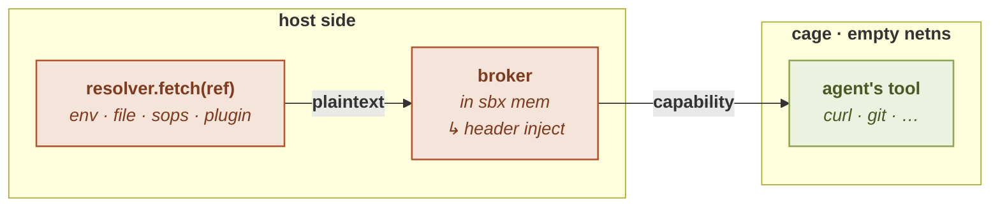

# Secrets

`sbx` lets an agent *authenticate* to a host without ever handing it the
credential. A GitHub token, an API key, a registry password: the plaintext is
read **on the host**, injected into the matching outbound request **on the
wire**, and torn down when the cage exits. The agent makes the HTTPS call it was
going to make anyway; `sbx` brokers the credential onto it. The secret's bytes
never enter the sandbox.

## The invariant: no plaintext secret in the cage

> **`sbx` never places a plaintext secret inside the cage.** Every resolution is
> host-side, before the cage starts. The agent receives a *capability*
> (authenticate to an allowed host), never the secret's bytes.

This is a hard line, on the same footing as the capability-bearing-userns
requirement and the immutable shared store. It is what makes the secret *absent
by construction* rather than merely present-but-discouraged:

- A **capability** is scoped and ephemeral: usable only while the cage runs, and
  only toward the hosts the [egress allowlist](../networking/modes) permits.
- A **secret** is permanent and portable: exfiltrate it once, reuse it forever,
  anywhere.

Holding a capability is not holding the secret. `sbx` blocks
**extraction/portability**, not in-session use (granting the use is the whole
point). The irreducible lever is therefore **least privilege at the source**: a
fine-scoped token or a read-only account is only as dangerous as its own
permissions. Scope the secret tightly where it lives.

### What the invariant covers, and what it does not

The invariant is about what `sbx` **places** in the cage, so it governs
**declared** secrets: the ones a `[secret]` entry names, resolved host-side and
brokered onto the wire. For those, the guarantee holds end to end.

A credential the app **acquires by itself** is a different thing. An agent that
completes an OAuth or SSO sign-in inside the cage receives its own token and
writes it to its [isolated home](../apps/home), where it persists between
launches. `sbx` never handed that token over, so the invariant has nothing to say
about it: it sits at rest in a file the agent can read.

It is not left unwatched, though. The proxy terminates the cage's TLS, so it sees
that credential the first time the cage authenticates with it, and from then on it
is scanned for like a declared one: refused if it is re-sent anywhere, masked if it
comes back in a response, hidden from `sbx net logs`. See
[observed credentials](redaction#credentials-the-cage-obtained-for-itself).

What that does **not** give you is the invariant. The token is still in the cage,
still at rest in a file, still usable by anything running there. What bounds it is
the perimeter: an empty network namespace, an egress allowlist deciding where
anything can be sent at all, and a home no other app or project shell can read.
That is real containment, and it is weaker than "the secret is absent by
construction". Where an app can authenticate with a value you declare instead,
prefer that: a declared secret is absent from the cage, an acquired one is merely
bounded inside it.

## Two host-side layers: resolver × broker

A secret declaration composes two orthogonal halves, and **both run host-side**:

| Layer | Role | Question it answers | Documented in |
|---|---|---|---|
| **Resolver** (SOURCE) | fetch the plaintext | *where does the value come from?* | [Resolvers](resolvers) |
| **Broker** (SINK) | expose only a capability to the cage | *how does the agent use it without seeing it?* | [Injection](injection) |

The resolver fetches the plaintext into `sbx`'s own host process (from an
environment variable, a file, a SOPS-encrypted store, or a resolver plugin). The
broker, today, HTTP-header injection, consumes that plaintext host-side and
puts only a capability in front of the cage. The plaintext is used and discarded
on the host; only ciphertext (if any) and capabilities ever cross into the cage.

The two layers compose freely: any source with any broker. Resolvers are the
open-ended, pluggable half (see [Plugins](../plugins/)); the broker that puts a
secret on the wire touches the security boundary, so it stays first-party. A broker
that terminates nothing and only stands in front of a host socket is pluggable under
its own contract, described in [The broker type](../plugins/broker).

## Injection is effective only under a filtering network

Header injection happens **inside the MITM egress proxy**, and that proxy only
exists under a filtering network posture. A `[secret]` declaration therefore does
nothing unless the cage's network is one of:

- `deny`: filtered egress, deny-by-default (an allowlist);
- `allow`: filtered egress, allow-by-default (a denylist);
- `ask`: filtered egress, park-and-confirm.

Under `network = "shared"` (the open host network) or `network = "none"` (an
empty, uplink-less namespace) there is no proxy on the wire, so a `[secret]`
**injects nothing**. `sbx` warns loudly rather than silently sending an
unauthenticated request: an agent that got a `401` should never have to guess
that the cause was a missing filtering posture. Likewise, a secret's destination
host must itself be reachable under the policy (present in the `allow` list, or
not denied), or the request is refused *before* injection.

See [Network modes](../networking/modes) and
[`[network]`](../configuration/network) for the posture that
makes secrets live.

## `[secret]` is a security field

The `[secret]` section is a **security field**: it is honored from the global
config or a **trusted** project, and dropped from an untrusted one: the same
gate that governs `binds`, `network`, and `nixpkgs`. An untrusted project can
declare a `[secret]` section all it likes; the whole section is discarded before
any resolver scheme is even looked up. See
[Security model](../concepts/security-model) and
[The trust gate](../concepts/trust).

The section is a TOML **table keyed by destination host** (not an array), with a
reserved `defaults` sub-table. The full schema: the terse `key` form, the
verbose `from` refs, `header`/`type`/`prefix`: is documented in
[Injection](injection) and [Resolvers](resolvers), and mirrored in
[`[secret]`](../configuration/secret).

## Backstops, and their honest limits

Two byte-exact tripwires guard the naive verbatim leak in each direction: the
proxy refuses an outbound request that carries a configured secret value, and
masks a secret that a cooperating upstream reflects back. They are **backstops,
not the boundary**: any encoding (base64, gzip) evades a byte-exact scan. The
real guarantee is structural: empty netns, the egress allowlist, and the fact
that a credential is bound to *one* destination host. See
[Redaction](redaction) for both tripwires and their scope.

## Where to go next

- [Resolvers](resolvers): the SOURCE layer: `env://`, `file://`,
  `sops://`, terse keys, and fallback chains.
- [Injection](injection): the HTTP-header broker: how a credential lands
  on the wire.
- [Redaction](redaction): the outbound and inbound secret tripwires.
- [OAuth sessions](oauth): taking a refresh token out of the cage, and the
  per-application traps of doing so.
- [Provider recipes](providers/): a ready-made block for around forty services, each
  with the request that proves the header arrived.
- [Plugins](../plugins/): the three plugin kinds, the manifest they share, and signed
  plugin stores.

## See also

- [`[secret]`](../configuration/secret): the `[secret]`
  config reference.
- [`[network]`](../configuration/network) and
  [Network modes](../networking/modes): the filtering posture that
  makes injection effective.
- [Security model](../concepts/security-model): where the
  never-in-cage invariant sits among `sbx`'s hard lines.
- [The trust gate](../concepts/trust): the trust gate that admits a
  project's `[secret]` section.
