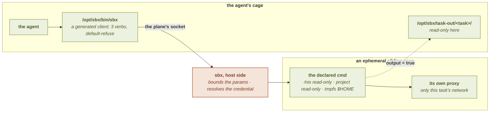

# Declared operations (`[task]`)

A **declared operation** is a fixed command sbx runs *on a caller's behalf*, in an ephemeral sibling
cage, with a credential the caller never holds. It is how an agent uses a database password or an API
token without the value ever entering its own cage.

```toml
[task.db-query]
description = "Read-only SQL against staging"
cmd     = ["psql", "-h", "db.staging.internal", "-c", "{sql}"]
params  = { sql = "^SELECT [A-Za-z0-9_,.*= ']{1,400}$" }
network = ["tcp://db.staging.internal:5432"]

[task.db-query.secret]
PGPASSWORD = "sops://secrets.enc.yaml#db.password"
```

> A task cage has **no network at all** unless `network` says otherwise, so the line above is not
> decoration, without it `psql` has nowhere to connect. A `tcp://` rule also gives the cage
> [somewhere to reach that host](network), so `-h db.staging.internal` works verbatim.

The agent then runs:

```sh
sbx task list
sbx task run db-query --param sql="SELECT id FROM users"
```

It never sees `PGPASSWORD`. sbx resolves it host-side, hands it to the command's environment in a
cage of its own, and returns the exit status and the output.

Trusted-only, like `[binds]`/`[seccomp]`/`[devices]`: an untrusted project may neither declare a task
nor loosen one. Declarable in the global config, a project's `.sbx.toml`, an app profile
(`[app.<name>.task.<task>]`) and a bundle (`[bundle.<name>.task.<task>]`).

See also: [Parameters](parameters) · [Credentials](credentials) · [Execution](execution) ·
[Output](output) · [Reaching a non-HTTP service](network) · [`[task]` reference](../configuration/task) ·
[`sbx task`](../cli/task).



The credential is resolved in the host-side step and reaches only the sibling cage,
which is why the caller can invoke the operation without ever holding what it needs.

## What makes it safe

**sbx fixes the program.** `cmd` is an argv list, never a shell string, and `cmd[0]` may carry no
placeholder. Nothing here ever reaches a shell, so `;`, `&&` and `||` are inert bytes inside an
argument; filtering them would be theater. What bounds the command is the fixed program, the
parameter bounds, and the absence of a shell.

**The command runs in its own cage, not the agent's.** In the agent's cage `/nix` is the per-project
store mounted read-write and a `mise` tool lives under a writable `$HOME`, so a same-uid agent could
overwrite the very binary a task is about to run. A task cage instead gets:

- the same hermetic FHS, `/etc` identity files and locales: so a task behaves like the project's own
  tooling;
- `/nix` **read-only from the shared store** (immutable, built host-side);
- the project **read-only**, a fresh tmpfs `$HOME`, its own pid namespace (so the agent cannot read
  the task's `/proc/<pid>/environ`), an empty network namespace, no stdin, no tty;
- every [`[fs] deny`](../configuration/fs) path closed here too, not only in the agent's cage. A task
  that legitimately needs one names it in its own
  [`unmask`](../configuration/fs#opening-a-path-for-one-operation), which lifts it for that task and
  no other: the operation reads the key, and the agent that invokes it never can;
- **nothing else**, a `[binds]` path, a Wayland or D-Bus socket, a granted device, the session's
  egress socket: none of them are in a task cage.

**What crosses into the agent's cage is a client, not sbx.** Declaring a task binds the plane's
socket into the sandbox, an agent that cannot reach it cannot invoke an operation. What is bound
beside it is a small generated script that speaks the plane's protocol and refuses every other word,
so the sandbox never holds a program able to act on sbx's own state. See
[what the cage actually holds](../cli/task#what-the-cage-actually-holds).

**Every caller-supplied value is bounded.** A parameter must declare a `match` pattern or an `enum`,
and the pattern must match the **whole** value. This is load-bearing rather than cosmetic: a value
loose enough to embed a comparison (`… WHERE substr(:tok,1,1)='a'`) turns the exit status into an
oracle over the credential. What sbx enforces is that a bound is *declared*: whether it excludes
anything is yours to write, and [a pattern matching everything](parameters#a-pattern-that-matches-everything-possible-not-recommended)
is accepted with the consequences that come with it.

## Checking a block was kept

`[task]` is trust-gated, and a block the validation rejects is dropped with a warning rather
than silently half-applied. [`sbx config show`](../cli/config#sbx-config-show) lists what
survived, without launching anything:

```
  tasks (declared operations a cage may run):
    build  Build the project  (project)
```

An operation you declared and do not see there was either dropped (read the warnings) or is
waiting on [`sbx trust`](../cli/trust). [`sbx task ls`](../cli/task) answers a different
question: what a session running *now* is offering.

## The quota, and the honest residual

Each session allows a bounded number of invocations (500). It is refused past that rather than
degraded, because an exit-status oracle over a credential gets cheaper the more calls it can make.
The quota, and the 512-invocation log ring behind [`sbx task logs`](../cli/task#logs), are
**fixed**: unlike the per-task [`timeout` and `max_output` ceilings](../configuration/task#section-defaults),
they are not `[task.defaults]` knobs.

A request is bounded before any of that is consulted. The plane runs in threads of the `sbx`
process, not in the cage, so what a caller sends is host memory rather than cage memory and no
cgroup ceiling applies to it: one parameter carries at most **1 MiB**, one whole request at most
**8 MiB** counting its field names, and a request line that never ends is refused instead of being
read. These are refusals of the framing, so they are answered before the quota is touched and
before anything about the task is looked up. **At most 32 connections are served at once** on each
of the plane's two sockets, since each one costs a host thread for as long as it lives; a caller
past that is refused rather than queued. The two sockets have separate ceilings, so a cage filling
the one it reaches cannot lock you out of [`sbx task status`](../cli/task#status) or
[`sbx task stop`](../cli/task#stop).

The residual to know: the socket a caller reaches is bound into the cage, and same-uid gives **no
per-process identity**. Its authority is therefore the **cage's**, not the agent's: any process in
the cage, including a subprocess of whatever the agent spawned, can invoke a task. That is why what
bounds a task is its fixed program and its bounded parameters, not who is calling.

## Where to go next

| Page | What it covers |
|---|---|
| [Parameters](parameters) | `params`, the bounds that hold a caller, and `env_allow` |
| [Credentials](credentials) | `secret`, `encode`, and wire-injected credentials |
| [Execution](execution) | which binaries a task may run: `spawn`, `[exec.<program>]`, the tool pool |
| [Output](output) | what substitution promises, and the `output` directory |
| [Reaching a non-HTTP service](network) | `tcp://` rules, in-cage listeners, and ssh |
| [`[task]` reference](../configuration/task) | every field, at a glance |
| [`sbx task`](../cli/task) | listing, invoking, and reading the invocation log |
